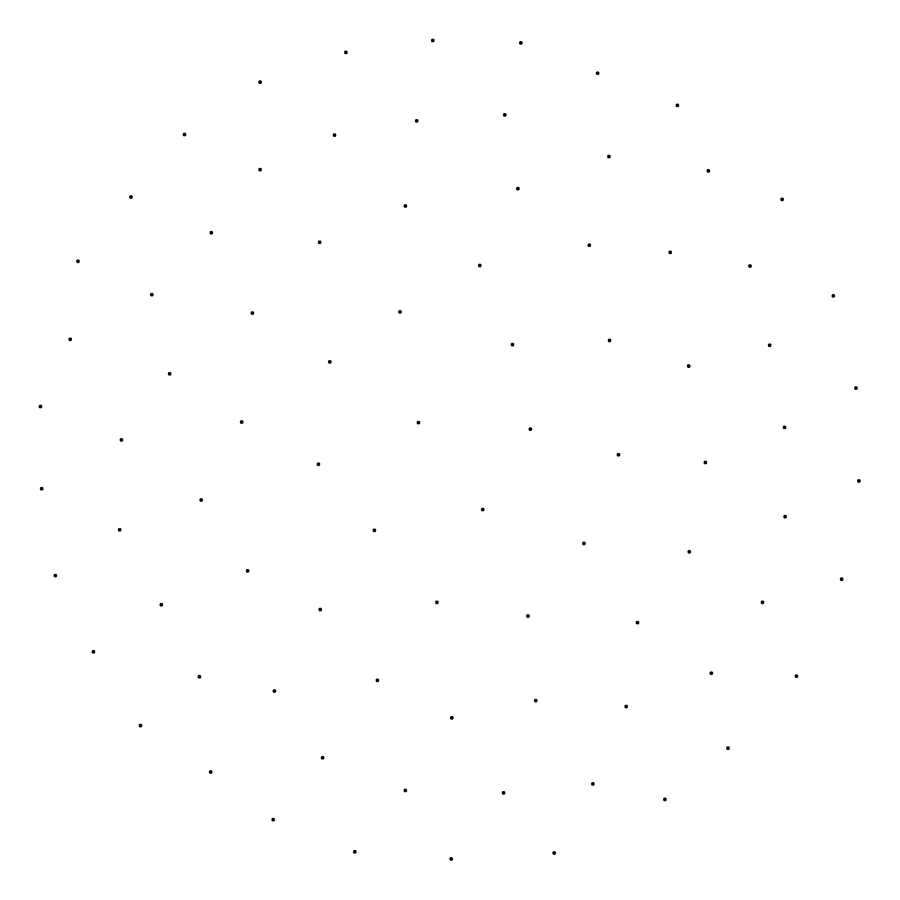
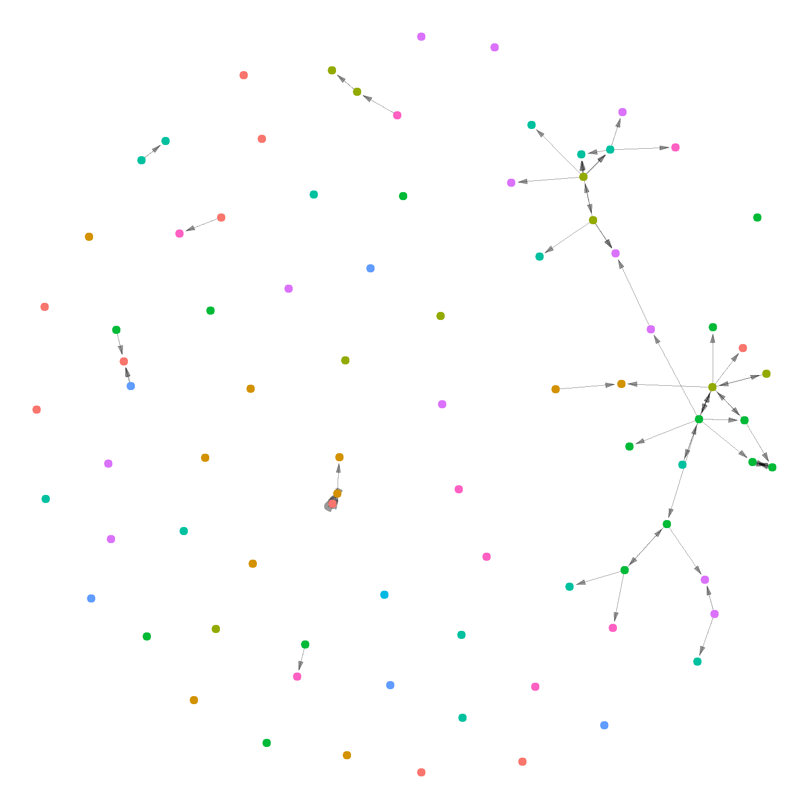
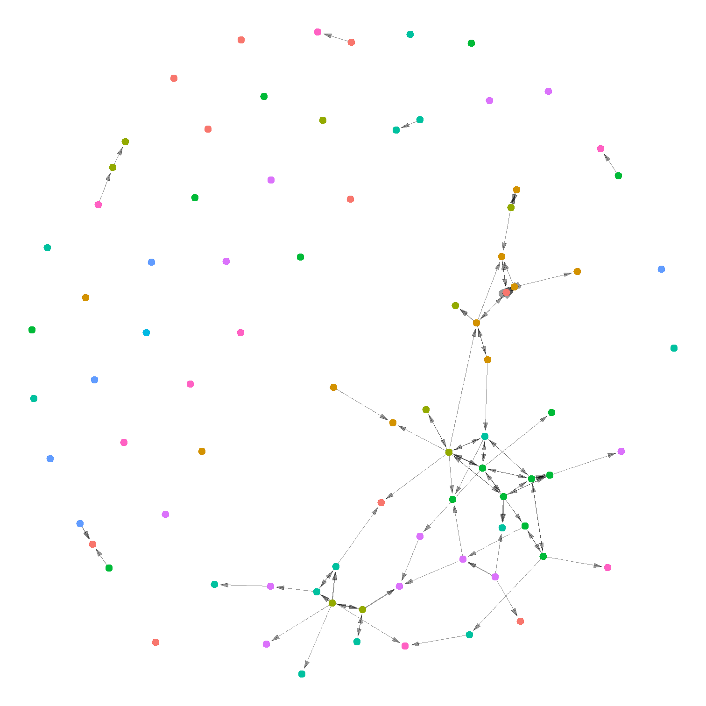

Example script analyzing the MIT Social Evolution data with `R`'s `goldfish`
package.
Models inspired by section 7 of:

> Stadtfeld & Block (2017), "Interactions, Actors and Time: Dynamic Network
> Actor Models for Relational Events", Sociological Science, 2017, 4(1):
> 318-352. DOI: 10.15195/v4.a14

# Step 0: Load package and data

First, we load the `goldfish` package and load the data.
The data is loaded using lazy loading, i.e., the objects are only 'promised'
for the moment, but are available in the environment to be used, and
more information will appear as you use them.
You can find out more about this dataset, its format, and its origins in
a couple of ERGM papers by callings its documentation:


``` r
library(goldfish)
data("Social_Evolution")
# ?Social_Evolution
head(calls)
#>         time   sender receiver increment
#> 1 1220733470 Actor 72 Actor 50         1
#> 2 1221102974 Actor 43 Actor 51         1
#> 3 1221784293 Actor 43 Actor 51         1
#> 4 1221785882 Actor 43 Actor 22         1
#> 5 1221787264 Actor 43 Actor 55         1
#> 6 1221848443 Actor 43 Actor 51         1
head(actors)
#>     label present floor gradeType
#> 1 Actor 1    TRUE     3         5
#> 2 Actor 2    TRUE     5         1
#> 3 Actor 3    TRUE     5         2
#> 4 Actor 4    TRUE     2         2
#> 5 Actor 5    TRUE     4         1
#> 6 Actor 6    TRUE     4         2
```

# Preamble: Run a quick DyNAM in six lines
We use an `R` version higher than 4.2.0 to compile the vignettes.
The native pipe operator is available in `R` from version 4.1.0.


``` r
callNetwork <- make_network(nodes = actors, directed = TRUE) |> # 1
  link_events(change_events = calls, nodes = actors) # 2

# 3
callsDependent <- make_dependent_events(
  events = calls, nodes = actors,
  default_network = callNetwork
  )

# 4
socialEvolutionData <- make_data(callsDependent, callNetwork, actors)

# 5
mod00Rate <- estimate_dynam(
  callsDependent ~ indeg + outdeg,
  sub_model = "rate",
  data = socialEvolutionData
  )

summary(mod00Rate)
#> 
#> Call:
#> estimate_dynam(x = callsDependent ~ indeg + outdeg, sub_model = "rate", 
#>     data = socialEvolutionData)
#> 
#> 
#> Coefficients:
#>        Estimate Std. Error z-value  Pr(>|z|)    
#> indeg  0.551445   0.066344  8.3119 < 2.2e-16 ***
#> outdeg 0.263784   0.028386  9.2927 < 2.2e-16 ***
#> ---
#> Signif. codes:  0 '***' 0.001 '**' 0.01 '*' 0.05 '.' 0.1 ' ' 1
#> 
#>   Converged with max abs. score of 2e-05 
#>   Log-Likelihood: -1750.9
#>   AIC:  3505.8 
#>   AICc: 3505.9 
#>   BIC:  3514 
#>   model: "DyNAM" subModel: "rate"

mod00Choice <- estimate_dynam(
  callsDependent ~ inertia + recip + trans,
  sub_model = "choice",
  data = socialEvolutionData
  )

summary(mod00Choice)
#> 
#> Call:
#> estimate_dynam(x = callsDependent ~ inertia + recip + trans, 
#>     sub_model = "choice", data = socialEvolutionData)
#> 
#> 
#> Coefficients:
#>         Estimate Std. Error z-value  Pr(>|z|)    
#> inertia  5.19690    0.17397 29.8725 < 2.2e-16 ***
#> recip    1.39802    0.17300  8.0812 6.661e-16 ***
#> trans   -0.23036    0.21554 -1.0687    0.2852    
#> ---
#> Signif. codes:  0 '***' 0.001 '**' 0.01 '*' 0.05 '.' 0.1 ' ' 1
#> 
#>   Converged with max abs. score of 7e-05 
#>   Log-Likelihood: -696.72
#>   AIC:  1399.4 
#>   AICc: 1399.5 
#>   BIC:  1411.7 
#>   model: "DyNAM" subModel: "choice"
```

# Step 1: Create data objects

## Step 1a: Make node set(s) and attributes

We've loaded a dataset that defines its nodes and their attributes as
a data frame. Let's check what we have first.


``` r
class(actors)
#> [1] "data.frame"
head(actors)
#>     label present floor gradeType
#> 1 Actor 1    TRUE     3         5
#> 2 Actor 2    TRUE     5         1
#> 3 Actor 3    TRUE     5         2
#> 4 Actor 4    TRUE     2         2
#> 5 Actor 5    TRUE     4         1
#> 6 Actor 6    TRUE     4         2
```

Note that there are four column variables: `label` the identifier, `present`,
the `floor` of residence, and `gradeType` their educational level
(1 = freshmen to 5 = graduate).
All of these columns will be recognized as individual attributes by goldfish.

We need to make them as nodes so that `goldfish` knows what to do with them.


``` r
actors <- make_nodes(actors)
actors
#> Number of nodes: 84 
#> Number of present nodes: 84 
#> 
#> First 6 rows
#>     label present floor gradeType
#> 1 Actor 1    TRUE     3         5
#> 2 Actor 2    TRUE     5         1
#> 3 Actor 3    TRUE     5         2
#> 4 Actor 4    TRUE     2         2
#> 5 Actor 5    TRUE     4         1
#> 6 Actor 6    TRUE     4         2
```

As you can see, the structure is the same, so we can still treat it like
a data frame, but the added class helps goldfish interpret the data frame
correctly.


## Step 1b: Make networks

Next we want to define the dyadic or network elements: calls between our actors.


``` r
head(calls)
#>         time   sender receiver increment
#> 1 1220733470 Actor 72 Actor 50         1
#> 2 1221102974 Actor 43 Actor 51         1
#> 3 1221784293 Actor 43 Actor 51         1
#> 4 1221785882 Actor 43 Actor 22         1
#> 5 1221787264 Actor 43 Actor 55         1
#> 6 1221848443 Actor 43 Actor 51         1
```

Note there are columns for `time`, `sender`, and `receiver`. `increment`
is a reserved column.

To tell goldfish this is a network, we must make it as such:

``` r
?make_network
```


``` r
callNetwork <- make_network(nodes = actors, directed = TRUE)
```

The argument `directed` is `TRUE` by default, but we need to specify
the nodes so that `goldfish` can check for consistency and relate it to
that nodeset as needed.


``` r
callNetwork
#> Dimensions: 84 84 
#> Number of ties (no weighted): 0 
#> Nodes set(s): actors 
#> It is a one-mode and directed network
#> 
#> First 6 rows and columns
#>          receiver
#> sender    Actor 1 Actor 2 Actor 3 Actor 4 Actor 5 Actor 6
#>   Actor 1       0       0       0       0       0       0
#>   Actor 2       0       0       0       0       0       0
#>   Actor 3       0       0       0       0       0       0
#>   Actor 4       0       0       0       0       0       0
#>   Actor 5       0       0       0       0       0       0
#>   Actor 6       0       0       0       0       0       0
```

Note that we have not added any network data yet. By default, `make_network()`
just constructs an empty matrix with dimensions defined by the length of the
nodeset(s).
So we have an empty network as a starting state.

Now that goldfish recognizes the matrix as a network, we can also associate
an event list that updates it.
To do this we use the `link_events()` function, which requires us to identify
a goldfish object to be updated, the events that update it and, in this case,
also the nodes that the events should relate to.
`goldfish` checks the consistency of all this information and relates these
objects to one another so that information can be called as needed.


``` r
?link_events
```


``` r
callNetwork <- link_events(
  x = callNetwork,
  change_events = calls,
  nodes = actors
)
callNetwork
#> Dimensions: 84 84 
#> Number of ties (no weighted): 0 
#> Nodes set(s): actors 
#> It is a one-mode and directed network
#> Linked events: calls 
#> 
#> First 6 rows and columns
#>          receiver
#> sender    Actor 1 Actor 2 Actor 3 Actor 4 Actor 5 Actor 6
#>   Actor 1       0       0       0       0       0       0
#>   Actor 2       0       0       0       0       0       0
#>   Actor 3       0       0       0       0       0       0
#>   Actor 4       0       0       0       0       0       0
#>   Actor 5       0       0       0       0       0       0
#>   Actor 6       0       0       0       0       0       0
```

### Task

You should now be able to do the same with the friendship nomination
network/event list.
See the familiar columns `time`, `sender`, and `receiver`.
The new column, `replace`, is an alternative treatment to `increment`.
When an event occurs, goldfish will replace the value in
the relevant cell with the value in this column instead of incrementing it.
Friendship is thus a binary network.


``` r
head(friendship)
#>         time   sender receiver replace
#> 1 1220918400 Actor 47  Actor 2       1
#> 3 1220918400 Actor 57  Actor 2       1
#> 4 1220918400  Actor 9 Actor 38       1
#> 5 1220918400 Actor 68 Actor 40       1
#> 6 1220918400 Actor 23 Actor 40       1
#> 7 1220918400 Actor 49 Actor 40       1
friendshipNetwork <- make_network(nodes = actors, directed = TRUE)
friendshipNetwork <- link_events(
  x = friendshipNetwork,
  change_events = friendship,
  nodes = actors
  )
friendshipNetwork
#> Dimensions: 84 84 
#> Number of ties (no weighted): 0 
#> Nodes set(s): actors 
#> It is a one-mode and directed network
#> Linked events: friendship 
#> 
#> First 6 rows and columns
#>          receiver
#> sender    Actor 1 Actor 2 Actor 3 Actor 4 Actor 5 Actor 6
#>   Actor 1       0       0       0       0       0       0
#>   Actor 2       0       0       0       0       0       0
#>   Actor 3       0       0       0       0       0       0
#>   Actor 4       0       0       0       0       0       0
#>   Actor 5       0       0       0       0       0       0
#>   Actor 6       0       0       0       0       0       0
```

## Step 1c: Make dependent events

The following step in defining the data objects is to identify 
the dependent events.
Here we would like to model as the dependent variable the calls
between individuals.
We specify the event list and the node list.


``` r
?make_dependent_events
```


``` r
callsDependent <- make_dependent_events(
  events = calls, nodes = actors,
  default_network = callNetwork
  )
callsDependent
#> Number of events: 439 
#> Nodes set(s): actors 
#> Default network: callNetwork 
#> 
#> First 6 rows
#>         time   sender receiver increment
#> 1 1220733470 Actor 72 Actor 50         1
#> 2 1221102974 Actor 43 Actor 51         1
#> 3 1221784293 Actor 43 Actor 51         1
#> 4 1221785882 Actor 43 Actor 22         1
#> 5 1221787264 Actor 43 Actor 55         1
#> 6 1221848443 Actor 43 Actor 51         1
```

## Step 1d: Make data object

Now that we have all the objects we need, we can make the data object.
The data object is a goldfish object that contains all the information
needed to estimate the model.
So, it is a container for the dependent events, the networks, and the nodes
containing all the information of the dependent events and any dyadic or
nodal covariate used as explanatory variables in the model.


``` r
?make_data
```


``` r
socialEvolutionData <- make_data(
  callsDependent, callNetwork, actors, friendshipNetwork
)
socialEvolutionData
#> Goldfish Data Environment
#> =========================
#> 
#> --- Nodesets ---
#>         n attributes linked_events
#> actors 84          3              
#> 
#> --- Networks ---
#>                   dimensions nodeset linked_events directed two_mode
#> callNetwork            84x84  actors         calls     TRUE    FALSE
#> friendshipNetwork      84x84  actors    friendship     TRUE    FALSE
#> 
#> --- Dependent Events ---
#>                n_events default_network nodeset
#> callsDependent      439     callNetwork  actors
#> 
#> --- Events Data Frames ---
#>            n_events object_type update_mode
#> calls           439      dyadic   increment
#> friendship      766      dyadic     replace
```

### Intermediate step: Visualization

While not a required part of the modeling process,
we highly recommend the visualization of your data for analytic and
diagnostic purposes.
`goldfish` includes wrappers for base `R` commands to help extract monadic
and dyadic information for certain time points, `?as.data.frame.nodes.goldfish`
and `?as.matrix.network.goldfish`.

We can use these functions to visually compare our network at two (or more)
different time periods using `migraph`. See the `migraph` package documentation
for additional information about network visualization.


``` r
library(igraph)
library(ggraph)
library(migraph)
# The network at the beginning
callNetworkBgn <- as.matrix(callNetwork)
graphr(callNetworkBgn, labels = FALSE, layout = "fr")
```



``` r

# The network at half time
callNetworkHlf <- as.matrix(
  callNetwork,
  time = calls$time[floor(nrow(calls) / 2)]
) |>
  as_igraph() |>
  add_node_attribute("floor", actors$floor)

graphr(callNetworkHlf, labels = FALSE, layout = "fr") +
  geom_node_point(aes(color = as.factor(floor)), size = 2, show.legend = FALSE)
```



``` r

# The network at the end
callNetworkEnd <- as.matrix(callNetwork, time = max(calls$time) + 1) |>
  as_igraph() |>
  add_node_attribute("floor", actors$floor)

graphr(callNetworkEnd, labels = FALSE, layout = "fr") +
  geom_node_point(aes(color = as.factor(floor)), size = 2, show.legend = FALSE)
```



``` r


# The tie strength at the end
table(as.matrix(callNetwork, time = max(calls$time) + 1))
#> 
#>    0    1    2    3    4    6    7    8    9   10   11   13   15   64  115 
#> 6972   36   13   10    8    1    5    3    1    1    1    2    1    1    1
```

# Step 2: Specify and estimate model

The second step is to specify and fit a model to this data.
This step can be broken up into several stages:

-   **Step 2a**. *Formula*: Specify a model formula from the effects and
  variables available

-   **Step 2b**. *Preprocessing*: Calculate the change statistics associated
  with these effects

-   **Step 2c**. *Estimation*: Fit an appropriate model to these statistics

However, in goldfish we also have the option of accelerating this process and
using memory more efficiently by combining these three sub-steps in one.
Nonetheless, it can be helpful to think of 2a separately, and
recognize steps 2b and 2c as goldfish does them.

## Step 2a. Formula

We specify our model using the standard R formula format like:

`goldfish_dependent ~ effects(process_state_element)`

We can see which effects are currently available and how to specify them here:


``` r
vignette("goldfishEffects")
```

Let's start with the simplest model we can imagine:


``` r
simpleFormulaChoice <- callsDependent ~ tie(friendshipNetwork)
```

What are we testing here?
Do individuals call their friends more than non-friends?

## Step 2b and 2c. Preprocessing and Estimation

Now to estimate this model, we use the `?estimate` function.
For now, only need to worry about the `formula` and the `model`,
`subModel` type (DyNAM-choice).


``` r
mod01Choice <- estimate_dynam(
  simpleFormulaChoice,
  sub_model = "choice",
  data = socialEvolutionData
  )
summary(mod01Choice)
#> 
#> Call:
#> estimate_dynam(x = callsDependent ~ tie(friendshipNetwork), sub_model = "choice", 
#>     data = socialEvolutionData)
#> 
#> 
#> Coefficients:
#>     Estimate Std. Error z-value  Pr(>|z|)    
#> tie  4.02538    0.12513   32.17 < 2.2e-16 ***
#> ---
#> Signif. codes:  0 '***' 0.001 '**' 0.01 '*' 0.05 '.' 0.1 ' ' 1
#> 
#>   Converged with max abs. score of 0 
#>   Log-Likelihood: -1288.7
#>   AIC:  2579.4 
#>   AICc: 2579.4 
#>   BIC:  2583.5 
#>   model: "DyNAM" subModel: "choice"
```

Ok, as fascinating as that was, perhaps we can test how robust
this finding is in the presence of plausible controls.


``` r
complexFormulaChoice <-
  callsDependent ~ inertia(callNetwork) + recip(callNetwork) +
                   tie(friendshipNetwork) + recip(friendshipNetwork) +
                   same(actors$gradeType) + same(actors$floor)

mod02Choice <- estimate_dynam(
  complexFormulaChoice,
  sub_model = "choice",
  data = socialEvolutionData
  )
summary(mod02Choice)
#> 
#> Call:
#> estimate_dynam(x = callsDependent ~ inertia(callNetwork) + recip(callNetwork) + 
#>     tie(friendshipNetwork) + recip(friendshipNetwork) + same(actors$gradeType) + 
#>     same(actors$floor), sub_model = "choice", data = socialEvolutionData)
#> 
#> 
#> Effects details:
#>         Object           
#> inertia callNetwork      
#> recip   callNetwork      
#> tie     friendshipNetwork
#> recip   friendshipNetwork
#> same    actors$gradeType 
#> same    actors$floor     
#> 
#> Coefficients:
#>         Estimate Std. Error z-value  Pr(>|z|)    
#> inertia  4.42057    0.19225 22.9936 < 2.2e-16 ***
#> recip    0.27151    0.19735  1.3758  0.168895    
#> tie      1.28779    0.25673  5.0160 5.275e-07 ***
#> recip    0.68625    0.22930  2.9928  0.002765 ** 
#> same     0.69847    0.17607  3.9670 7.279e-05 ***
#> same    -0.28700    0.16618 -1.7271  0.084155 .  
#> ---
#> Signif. codes:  0 '***' 0.001 '**' 0.01 '*' 0.05 '.' 0.1 ' ' 1
#> 
#>   Converged with max abs. score of 0 
#>   Log-Likelihood: -637.96
#>   AIC:  1287.9 
#>   AICc: 1288.1 
#>   BIC:  1312.4 
#>   model: "DyNAM" subModel: "choice"
```

### Rate model

How do individual properties affect the rate of action of individuals?
(Step 1 of the model)

Let us again define a simple formula that only depends on individuals' degree
in the friendship network


``` r
simpleFormulaRate <- callsDependent ~ indeg(friendshipNetwork)
mod01Rate <- estimate_dynam(
  simpleFormulaRate,
  sub_model = "rate",
  data = socialEvolutionData
  )
```

#### Remark:

Sometimes, the default values for the algorithm are not enough
to reach convergence.
The default values for the estimation algorithm are set by the function
`set_estimation_opt()`, you can take a look to the different arguments and
options that can be modified for the estimation algorithm taking a look to its
documentation.
We can remedy this by increasing the number of iterations setting a different
value using the `control_estimation` argument:


``` r
mod01Rate <- estimate_dynam(
  simpleFormulaRate,
  sub_model = "rate",
  data = socialEvolutionData,
  control_estimation = set_estimation_opt(max_iterations = 40)
  )
summary(mod01Rate)
#> 
#> Call:
#> estimate_dynam(x = callsDependent ~ indeg(friendshipNetwork), 
#>     sub_model = "rate", data = socialEvolutionData, control_estimation = set_estimation_opt(max_iterations = 40))
#> 
#> 
#> Coefficients:
#>       Estimate Std. Error z-value  Pr(>|z|)    
#> indeg 0.157370   0.012699  12.392 < 2.2e-16 ***
#> ---
#> Signif. codes:  0 '***' 0.001 '**' 0.01 '*' 0.05 '.' 0.1 ' ' 1
#> 
#>   Converged with max abs. score of 0 
#>   Log-Likelihood: -1868.1
#>   AIC:  3738.3 
#>   AICc: 3738.3 
#>   BIC:  3742.3 
#>   model: "DyNAM" subModel: "rate"
```

What if we include additional structural effects?
Let us add the in and out degree of the nodes in the call network


``` r
complexFormulaRate <-
  callsDependent ~ indeg(callNetwork) + outdeg(callNetwork) +
                   indeg(friendshipNetwork)

mod02Rate <- estimate_dynam(
  complexFormulaRate,
  sub_model = "rate",
  data = socialEvolutionData
)
summary(mod02Rate)
#> 
#> Call:
#> estimate_dynam(x = callsDependent ~ indeg(callNetwork) + outdeg(callNetwork) + 
#>     indeg(friendshipNetwork), sub_model = "rate", data = socialEvolutionData)
#> 
#> 
#> Effects details:
#>        Object           
#> indeg  callNetwork      
#> outdeg callNetwork      
#> indeg  friendshipNetwork
#> 
#> Coefficients:
#>        Estimate Std. Error z-value  Pr(>|z|)    
#> indeg  0.454676   0.070918  6.4113 1.443e-10 ***
#> outdeg 0.240231   0.029494  8.1452 4.441e-16 ***
#> indeg  0.060809   0.015464  3.9324 8.409e-05 ***
#> ---
#> Signif. codes:  0 '***' 0.001 '**' 0.01 '*' 0.05 '.' 0.1 ' ' 1
#> 
#>   Converged with max abs. score of 2e-05 
#>   Log-Likelihood: -1743.2
#>   AIC:  3492.5 
#>   AICc: 3492.5 
#>   BIC:  3504.7 
#>   model: "DyNAM" subModel: "rate"
```

#### Right-censored intervals

Recall that it is important to add a time intercept when estimating models with
right-censored intervals (as discussed in Stadtfeld & Block, 2017).
Adding an intercept is as easy as including a 1 to the formula:


``` r
interceptFormulaRate <-
  callsDependent ~ 1 + indeg(callNetwork) + outdeg(callNetwork) +
                   indeg(friendshipNetwork)

mod03Rate <- estimate_dynam(
  interceptFormulaRate,
  sub_model = "rate",
  data = socialEvolutionData
)
summary(mod03Rate)
#> 
#> Call:
#> estimate_dynam(x = callsDependent ~ 1 + indeg(callNetwork) + 
#>     outdeg(callNetwork) + indeg(friendshipNetwork), sub_model = "rate", 
#>     data = socialEvolutionData)
#> 
#> 
#> Effects details:
#>           Object           
#> Intercept                  
#> indeg     callNetwork      
#> outdeg    callNetwork      
#> indeg     friendshipNetwork
#> 
#> Coefficients:
#>             Estimate Std. Error   z-value  Pr(>|z|)    
#> Intercept -14.380373   0.095669 -150.3135 < 2.2e-16 ***
#> indeg       0.695555   0.063115   11.0204 < 2.2e-16 ***
#> outdeg      0.234633   0.030153    7.7814 7.105e-15 ***
#> indeg       0.054792   0.015049    3.6409 0.0002716 ***
#> ---
#> Signif. codes:  0 '***' 0.001 '**' 0.01 '*' 0.05 '.' 0.1 ' ' 1
#> 
#>   Converged with max abs. score of 0 
#>   Log-Likelihood: -6003.1
#>   AIC:  12014 
#>   AICc: 12014 
#>   BIC:  12031 
#>   model: "DyNAM" subModel: "rate"
```

Note that $1 / \exp({\beta_{intercept}})$ is the waiting time
without any covariates, or how long it takes to make the next phone call
if everything else is set to 0.
Therefore, the larger the intercept the shorter the waiting time.
For example, an intercept of -14 means a waiting time of
$1 / e^{-14} = 334$ hours. 
The baseline waiting time between two events in hours:


``` r
mod03RateCoef <- coef(mod03Rate)
1 / exp(mod03RateCoef[["Intercept"]]) / 3600
#> [1] 488.6682
# or days:
1 / exp(mod03RateCoef[["Intercept"]]) / 86400
#> [1] 20.36118

# But what if it is not just a random call?
# Expected waiting time of those who have five outgoing call ties
# (five different actors)
1 / exp(
  mod03RateCoef[["Intercept"]] + mod03RateCoef[["outdeg"]] * 5
  ) / 3600
#> [1] 151.1872
# Expected waiting time of those who have five outgoing and incoming call ties
# (five different actors)
1 / exp(
  mod03RateCoef[["Intercept"]] +
    mod03RateCoef[["outdeg"]] * 5 +
    mod03RateCoef[["indeg"]] * 5
  ) / 3600
#> [1] 4.66806
```

### Windows effects

Remember our `callNetwork` process state accumulates actions in time,
but some older actions may no longer be relevant to current action. 
Let's see whether it is really just recent partners that matter
by adding extra effects with a window of... how long?
Let us try 5 minutes $= 5 * 60 = 300s$


``` r
windowFormulaRate <-
  callsDependent ~ 1 + indeg(callNetwork) + outdeg(callNetwork) +
                   indeg(callNetwork, window = 300) +
                   outdeg(callNetwork, window = 300) +
                   indeg(friendshipNetwork)

mod04Rate <- estimate_dynam(
  windowFormulaRate,
  sub_model = "rate",
  data = socialEvolutionData
)
summary(mod04Rate)
#> 
#> Call:
#> estimate_dynam(x = callsDependent ~ 1 + indeg(callNetwork) + 
#>     outdeg(callNetwork) + indeg(callNetwork, window = 300) + 
#>     outdeg(callNetwork, window = 300) + indeg(friendshipNetwork), 
#>     sub_model = "rate", data = socialEvolutionData)
#> 
#> 
#> Effects details:
#>           Object            window
#> Intercept                         
#> indeg     callNetwork             
#> outdeg    callNetwork             
#> indeg     callNetwork       300   
#> outdeg    callNetwork       300   
#> indeg     friendshipNetwork       
#> 
#> Coefficients:
#>             Estimate Std. Error   z-value  Pr(>|z|)    
#> Intercept -14.530750   0.101676 -142.9125 < 2.2e-16 ***
#> indeg       0.245045   0.070682    3.4669 0.0005266 ***
#> outdeg      0.364576   0.032556   11.1985 < 2.2e-16 ***
#> indeg       5.295709   0.139463   37.9722 < 2.2e-16 ***
#> outdeg     -0.767499   0.116642   -6.5800 4.706e-11 ***
#> indeg       0.083772   0.015289    5.4794 4.268e-08 ***
#> ---
#> Signif. codes:  0 '***' 0.001 '**' 0.01 '*' 0.05 '.' 0.1 ' ' 1
#> 
#>   Converged with max abs. score of 1e-05 
#>   Log-Likelihood: -5475.9
#>   AIC:  10964 
#>   AICc: 10964 
#>   BIC:  10992 
#>   model: "DyNAM" subModel: "rate"
```

Of course, you can also add windows to the choice formula!


``` r
windowFormulaChoice <-
  callsDependent ~ inertia(callNetwork) + recip(callNetwork) +
                   inertia(callNetwork, window = 300) +
                   recip(callNetwork, window = 300) +
                   tie(friendshipNetwork) + recip(friendshipNetwork) +
                   same(actors$gradeType) + same(actors$floor)

mod03Choice <- estimate_dynam(
  windowFormulaChoice,
  sub_model = "choice",
  data = socialEvolutionData
)
summary(mod03Choice)
#> 
#> Call:
#> estimate_dynam(x = callsDependent ~ inertia(callNetwork) + recip(callNetwork) + 
#>     inertia(callNetwork, window = 300) + recip(callNetwork, window = 300) + 
#>     tie(friendshipNetwork) + recip(friendshipNetwork) + same(actors$gradeType) + 
#>     same(actors$floor), sub_model = "choice", data = socialEvolutionData)
#> 
#> 
#> Effects details:
#>         Object            window
#> inertia callNetwork             
#> recip   callNetwork             
#> inertia callNetwork       300   
#> recip   callNetwork       300   
#> tie     friendshipNetwork       
#> recip   friendshipNetwork       
#> same    actors$gradeType        
#> same    actors$floor            
#> 
#> Coefficients:
#>         Estimate Std. Error z-value  Pr(>|z|)    
#> inertia  4.29828    0.20193 21.2863 < 2.2e-16 ***
#> recip   -0.48574    0.23205 -2.0932 0.0363293 *  
#> inertia  1.39628    0.36093  3.8685 0.0001095 ***
#> recip    5.02256    0.73879  6.7983 1.058e-11 ***
#> tie      1.50593    0.27206  5.5354 3.105e-08 ***
#> recip    0.62314    0.24975  2.4951 0.0125930 *  
#> same     0.44865    0.19815  2.2641 0.0235659 *  
#> same    -0.20953    0.18139 -1.1551 0.2480445    
#> ---
#> Signif. codes:  0 '***' 0.001 '**' 0.01 '*' 0.05 '.' 0.1 ' ' 1
#> 
#>   Converged with max abs. score of 9e-05 
#>   Log-Likelihood: -565.9
#>   AIC:  1147.8 
#>   AICc: 1148.1 
#>   BIC:  1180.5 
#>   model: "DyNAM" subModel: "choice"
```

All this shows you that you can specify different formula
for the rate and choice components of the model.
This is a key advantage of the DyNAM!

When comparing the information criteria (AIC / BIC) of the different models,
we see that the time windows explain a lot


``` r
# Compare different specifications of the subModel = "choice"
AIC(mod02Choice, mod03Choice)
#>             df      AIC
#> mod02Choice  6 1287.912
#> mod03Choice  8 1147.804

# Compare different specifications of the subModel = "rate"
AIC(mod03Rate, mod04Rate)
#> Warning in AIC.default(mod03Rate, mod04Rate): models are not all fitted to the same number of
#> observations
#>           df      AIC
#> mod03Rate  4 12014.20
#> mod04Rate  6 10963.75
```

### REM with `goldfish`

`goldfish` does not only run DyNAMs; it also runs REMs (Butts, 2008).
We can now also run REMs using the right-censored intervals as introduced in
Stadtfeld & Block (2017).
An equivalent model specification to the DyNAM model we estimated above,
including the rate and choice sub-models, is:


``` r
allFormulaREM <-
  callsDependent ~ 
    1 + indeg(callNetwork, type = "ego") + outdeg(callNetwork, type = "ego") +
    indeg(friendshipNetwork, type = "ego") +
    inertia(callNetwork) + recip(callNetwork) +
    inertia(callNetwork, window = 300) + recip(callNetwork, window = 300) +
    tie(friendshipNetwork) + recip(friendshipNetwork) +
    same(actors$gradeType) + same(actors$floor)
```

And we can estimate this model, to speed up estimation, we can use any of the
two `C` implementations of the estimation algorithm.
Setting the option `engine` on the `estimationInit` argument, we can choose
which version of the `C` code to use.
`"default_c"` implements the same algorithm as
the default one implemented in plain `R` code that reduces the memory use
by exploiting the sparsity of the dyads that change the effects' statistics
after each event.
`"gather_compute"` implements a version with an overhead of memory use,
representing the data in a more usual tabular way but reducing time estimation.


``` r
mod01REM <- estimate_rem(
  allFormulaREM,
  data = socialEvolutionData,
  control_estimation =
    set_estimation_opt(initial_damping = 40, engine = "default_c")
)
```


``` r
mod01REM <- estimate_rem(
  allFormulaREM,
  data = socialEvolutionData,
  control_estimation = set_estimation_opt(engine = "gather_compute")
)

summary(mod01REM)
#> 
#> Call:
#> estimate_rem(x = callsDependent ~ 1 + indeg(callNetwork, type = "ego") + 
#>     outdeg(callNetwork, type = "ego") + indeg(friendshipNetwork, 
#>     type = "ego") + inertia(callNetwork) + recip(callNetwork) + 
#>     inertia(callNetwork, window = 300) + recip(callNetwork, window = 300) + 
#>     tie(friendshipNetwork) + recip(friendshipNetwork) + same(actors$gradeType) + 
#>     same(actors$floor), data = socialEvolutionData, control_estimation = set_estimation_opt(engine = "gather_compute"))
#> 
#> 
#> Effects details:
#>           Object              type  window
#> Intercept ""                  ""    ""    
#> indeg     "callNetwork"       "ego" ""    
#> outdeg    "callNetwork"       "ego" ""    
#> indeg     "friendshipNetwork" "ego" ""    
#> inertia   "callNetwork"       ""    ""    
#> recip     "callNetwork"       ""    ""    
#> inertia   "callNetwork"       ""    "300" 
#> recip     "callNetwork"       ""    "300" 
#> tie       "friendshipNetwork" ""    ""    
#> recip     "friendshipNetwork" ""    ""    
#> same      "actors$gradeType"  ""    ""    
#> same      "actors$floor"      ""    ""    
#> 
#> Coefficients:
#>             Estimate Std. Error   z-value  Pr(>|z|)    
#> Intercept -19.763568   0.136731 -144.5434 < 2.2e-16 ***
#> indeg       0.086900   0.071528    1.2149 0.2243968    
#> outdeg     -0.222330   0.040445   -5.4971 3.860e-08 ***
#> indeg       0.010742   0.017245    0.6229 0.5333320    
#> inertia     6.203483   0.189796   32.6850 < 2.2e-16 ***
#> recip      -0.313425   0.154555   -2.0279 0.0425690 *  
#> inertia    -1.589903   0.179494   -8.8577 < 2.2e-16 ***
#> recip       7.013842   0.170730   41.0814 < 2.2e-16 ***
#> tie         0.853373   0.206297    4.1366 3.525e-05 ***
#> recip       0.930856   0.194742    4.7800 1.753e-06 ***
#> same        0.470688   0.132528    3.5516 0.0003829 ***
#> same       -0.670748   0.123206   -5.4441 5.207e-08 ***
#> ---
#> Signif. codes:  0 '***' 0.001 '**' 0.01 '*' 0.05 '.' 0.1 ' ' 1
#> 
#>   Converged with max abs. score of 0 
#>   Log-Likelihood: -5639
#>   AIC:  11302 
#>   AICc: 11302 
#>   BIC:  11359 
#>   model: "REM" subModel: "choice"
```

