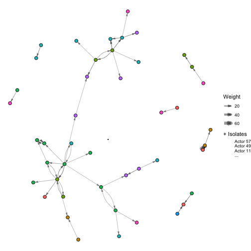

Example script analyzing the MIT Social Evolution data with `R`'s `goldfish`
package.
Models inspired by section 7 of:

> Stadtfeld & Block (2017), "Interactions, Actors and Time: Dynamic Network
> Actor Models for Relational Events", Sociological Science, 2017, 4(1):
> 318-352. DOI: 10.15195/v4.a14

# Step 0: Load package and data

First, we load the `goldfish` package.
`goldfish` consumes a **single data object**: a `stocnet` (from the
[`manynet`](https://stocnet.github.io/manynet/) package) that bundles the node
set, the network layers, and any attribute changes together.
The package ships the Social Evolution study prebuilt in that shape as
`social_evolution`, ready to model.
You can find out more about this dataset, its format, and its origins by calling
its documentation.


``` r
library(goldfish)
data("social_evolution")
# ?social_evolution
social_evolution
#> # A tibble: 84 × 4
#>   label    active floor gradeType
#>   <chr>    <lgl>  <dbl>     <dbl>
#> 1 Actor 47 TRUE       4         3
#> 2 Actor 57 TRUE       2         1
#> 3 Actor 9  TRUE       9         2
#> 4 Actor 68 TRUE       8         1
#> 5 Actor 23 TRUE       5         2
#> 6 Actor 49 TRUE       7         4
#> # ℹ 78 more rows
#> # A tibble: 1,205 × 5
#>    from    to time                weight layer     
#>   <int> <int> <dttm>               <dbl> <chr>     
#> 1     1    64 2008-09-09 00:00:00      1 friendship
#> 2     2    64 2008-09-09 00:00:00      1 friendship
#> 3     3    67 2008-09-09 00:00:00      1 friendship
#> 4     4    62 2008-09-09 00:00:00      1 friendship
#> 5     5    62 2008-09-09 00:00:00      1 friendship
#> 6     6    62 2008-09-09 00:00:00      1 friendship
#> # ℹ 1,199 more rows
```

The object carries two **layers** over one node set of 84 actors: `calls`, the
time-stamped phone calls (an `"event"` layer), and `friendship`, the survey
nominations (a `"panel"` layer). The `calls` layer is the **focal** layer --
the dependent process we model.

# Preamble: Run a quick DyNAM in three lines

We use an `R` version higher than 4.2.0 to compile the vignettes.
The native pipe operator is available in `R` from version 4.1.0.

With the prebuilt object there is nothing to assemble -- the focal `calls` layer
names the dependent process on the left-hand side of the formula:


``` r
mod00Rate <- estimate_dynam(
  calls ~ indeg + outdeg,
  sub_model = "rate",
  data = social_evolution
)
#> Warning: ! `sub_model = "rate"` with a formula without the time intercept is deprecated.
#> ℹ Use `sub_model = "rate_ordered"` to model only the order of the events.
summary(mod00Rate)
#> 
#> Call:
#> estimate_dynam(x = calls ~ indeg + outdeg, sub_model = "rate", 
#>     data = social_evolution)
#> 
#> 
#> Coefficients:
#>              Estimate Std. Error z-value  Pr(>|z|)    
#> indeg/calls  0.551445   0.066344  8.3119 < 2.2e-16 ***
#> outdeg/calls 0.263784   0.028386  9.2927 < 2.2e-16 ***
#> ---
#> Signif. codes:  0 '***' 0.001 '**' 0.01 '*' 0.05 '.' 0.1 ' ' 1
#> 
#>   Return code 1: gradient close to zero
#>     score (rel. norm): 1.06e-08    step (max|update|): 1.86e-08
#>   2 parameters estimated  
#>   Log-Likelihood: -1750.9
#>   AIC:  3505.8 
#>   AICc: 3505.9 
#>   BIC:  3514 
#>   model: "DyNAM" sub_model: "rate"

mod00Choice <- estimate_dynam(
  calls ~ inertia + recip + trans,
  sub_model = "choice",
  data = social_evolution
)
summary(mod00Choice)
#> 
#> Call:
#> estimate_dynam(x = calls ~ inertia + recip + trans, sub_model = "choice", 
#>     data = social_evolution)
#> 
#> 
#> Coefficients:
#>               Estimate Std. Error z-value  Pr(>|z|)    
#> inertia/calls  5.19690    0.17397 29.8725 < 2.2e-16 ***
#> recip/calls    1.39802    0.17300  8.0812 6.661e-16 ***
#> trans/calls   -0.23036    0.21554 -1.0687    0.2852    
#> ---
#> Signif. codes:  0 '***' 0.001 '**' 0.01 '*' 0.05 '.' 0.1 ' ' 1
#> 
#>   Return code 1: gradient close to zero
#>     score (rel. norm): 1.05e-07    step (max|update|): 1.60e-06
#>   3 parameters estimated  
#>   Log-Likelihood: -696.72
#>   AIC:  1399.4 
#>   AICc: 1399.5 
#>   BIC:  1411.7 
#>   model: "DyNAM" sub_model: "choice"
```

# Step 1: How the data object is built

The prebuilt `social_evolution` object was assembled from the raw data frames
that ship as `Social_Evolution`. Understanding that construction workflow lets
you bring your own data into `goldfish`. Everything here uses `manynet`, the
package that owns the `stocnet` data structure.


``` r
library(manynet)
data("Social_Evolution")
head(actors)
#>     label present floor gradeType
#> 1 Actor 1    TRUE     3         5
#> 2 Actor 2    TRUE     5         1
#> 3 Actor 3    TRUE     5         2
#> 4 Actor 4    TRUE     2         2
#> 5 Actor 5    TRUE     4         1
#> 6 Actor 6    TRUE     4         2
head(calls)
#>                  time   sender receiver increment
#> 1 2008-09-06 20:37:50 Actor 72 Actor 50         1
#> 2 2008-09-11 03:16:14 Actor 43 Actor 51         1
#> 3 2008-09-19 00:31:33 Actor 43 Actor 51         1
#> 4 2008-09-19 00:58:02 Actor 43 Actor 22         1
#> 5 2008-09-19 01:21:04 Actor 43 Actor 55         1
#> 6 2008-09-19 18:20:43 Actor 43 Actor 51         1
head(friendship)
#>         time   sender receiver replace
#> 1 2008-09-09 Actor 47  Actor 2       1
#> 3 2008-09-09 Actor 57  Actor 2       1
#> 4 2008-09-09  Actor 9 Actor 38       1
#> 5 2008-09-09 Actor 68 Actor 40       1
#> 6 2008-09-09 Actor 23 Actor 40       1
#> 7 2008-09-09 Actor 49 Actor 40       1
```

`actors` holds the node attributes: `label` (the identifier), `present`
(renamed `active` in the stocnet), the `floor` of residence, and `gradeType`
(1 = freshmen to 5 = graduate). `calls` and `friendship` are event lists with
`time`, `sender`, and `receiver`; `calls` carries an `increment` column (the
tie strength accumulates) while `friendship` carries a `replace` column (each
survey wave overwrites the value).

## Step 1a: One layer at a time

`as_stocnet()` turns an event list (or an adjacency matrix) into a single-layer
`stocnet`. `from_ties()` merges several layers over one shared node set, and
`join_nodes()` attaches the actor attributes.


``` r
social_evolution_built <- from_ties(
  as_stocnet(friendship),
  as_stocnet(calls),
  layer_names = c("friendship", "calls")
) |>
  join_nodes(actors) |>
  rename_nodes()
#> Joining with `by = join_by(label)`
social_evolution_built
#> 
#> ── # friendship + calls ────────────────────────────────────────────────────────
#> # A dynamic, labelled, multiplex, weighted, undirected network of 84 nodes and
#> 1205 friendship ties and 1205 calls ties from 2008-09-06 20:37:50 to 2008-10-19
#> 
#> ── Nodes
#> # A tibble: 84 × 4
#>   label    active floor gradeType
#>   <chr>    <lgl>  <dbl>     <dbl>
#> 1 Actor 47 TRUE       4         3
#> 2 Actor 57 TRUE       2         1
#> 3 Actor 9  TRUE       9         2
#> 4 Actor 68 TRUE       8         1
#> 5 Actor 23 TRUE       5         2
#> 6 Actor 49 TRUE       7         4
#> # ℹ 78 more rows
#> 
#> ── Ties
#> # A tibble: 1,205 × 5
#>    from    to time                weight layer     
#>   <int> <int> <dttm>               <dbl> <chr>     
#> 1     1    64 2008-09-09 00:00:00      1 friendship
#> 2     2    64 2008-09-09 00:00:00      1 friendship
#> 3     3    67 2008-09-09 00:00:00      1 friendship
#> 4     4    62 2008-09-09 00:00:00      1 friendship
#> 5     5    62 2008-09-09 00:00:00      1 friendship
#> 6     6    62 2008-09-09 00:00:00      1 friendship
#> # ℹ 1,199 more rows
#> 
```

## Step 1b: Declaring the layer semantics

`add_info()` records the metadata `goldfish` needs: which layer is `focal` (the
dependent process), whether each layer is `directed`, and each layer's
`observation` type. `goldfish` models two observation types:

- an `"event"` layer is a stream of time-stamped relational events (the
  `calls`), and
- a `"panel"` layer is a covariate observed at survey waves (the
  `friendship`), whose rows are applied at their wave times.


``` r
social_evolution_built <- add_info(
  social_evolution_built,
  name = "Social Evolution MIT",
  focal = "calls",
  directed = c(friendship = TRUE, calls = TRUE),
  observation = c(friendship = "panel", calls = "event")
)
```

This reproduces the shipped `social_evolution`, so the rest of the vignette
simply uses the prebuilt object.

A few conventions worth knowing when you assemble your own data:

- **History with `time = NA`.** Ties that hold *before* the observation window
  (for example, an initial adjacency matrix) enter with `time = NA`; they seed
  the starting state instead of becoming events. (Social Evolution starts from
  an empty network, so it has no history rows -- the Fisheries vignette shows
  this.)
- **Panel dissolutions are explicit.** A `"panel"` layer only knows what its
  rows say: to *remove* a tie at a wave you must include an explicit value-`0`
  row. `goldfish` cannot infer a dissolution from the absence of a row.
- **Mode sets restrict a layer.** With a single node set every layer spans all
  the nodes. In a multimodal node set an *undeclared* layer still spans **all**
  modes; declare `sender`/`receiver` mode sets in `add_info()` to make a layer
  one-mode over a subset, or two-mode across disjoint sets.
- **Tie-break with `order`.** If two events with the same `replace` target hit
  the exact same timestamp, add an integer `order` column so their sequence is
  unambiguous (again, see the Fisheries vignette).

## Intermediate step: Visualization

While not a required part of the modeling process,
we highly recommend the visualization of your data for analytic and
diagnostic purposes.
`goldfish` exports `network_state_at()` and `nodes_state_at()` to evaluate a
layer's network -- and the node attributes -- at any time point, honoring the
history and each layer's update semantics.

We can use these to visually compare the call network at two (or more)
different time periods using `migraph`. See the `migraph` package documentation
for additional information about network visualization.


``` r
library(igraph)
library(ggraph)
library(migraph)
# The network at half time
half_time <- calls$time[floor(nrow(calls) / 2)]
callNetworkHlf <- network_state_at(social_evolution, "calls", time = half_time)
floorHlf <- nodes_state_at(social_evolution, time = half_time)$floor

callNetworkHlf <- callNetworkHlf |>
  as_igraph() |>
  add_node_attribute("floor", floorHlf)

graphr(callNetworkHlf, labels = FALSE, layout = "fr") +
  geom_node_point(aes(color = as.factor(floor)), size = 2, show.legend = FALSE)
```



``` r

# The tie strength at the end
end_time <- max(calls$time) + 1
callNetworkEnd <- network_state_at(social_evolution, "calls", time = end_time)
table(callNetworkEnd)
#> callNetworkEnd
#>    0    1    2    3    4    6    7    8    9   10   11   13   15   64  115 
#> 6972   36   13   10    8    1    5    3    1    1    1    2    1    1    1
```

# Step 2: Specify and estimate model

The second step is to specify and fit a model to this data.
This step can be broken up into several stages:

-   **Step 2a**. *Formula*: Specify a model formula from the effects and
  variables available

-   **Step 2b**. *Preprocessing*: Calculate the change statistics associated
  with these effects

-   **Step 2c**. *Estimation*: Fit an appropriate model to these statistics

However, in goldfish we also have the option of accelerating this process and
using memory more efficiently by combining these three sub-steps in one.
Nonetheless, it can be helpful to think of 2a separately, and
recognize steps 2b and 2c as goldfish does them.

## Step 2a. Formula

We specify our model using the standard R formula format like:

`layer ~ effects(process_state_element)`

The left-hand side names the **focal layer** (`calls`); an effect's argument
names another **layer** (`friendship`) or a **node attribute** (`floor`,
`gradeType`) by its bare name. An effect with no argument reads the focal layer.

We can see which effects are currently available and how to specify them here:


``` r
vignette("goldfishEffects")
```

Let's start with the simplest model we can imagine:


``` r
simpleFormulaChoice <- calls ~ tie(friendship)
```

What are we testing here?
Do individuals call their friends more than non-friends?

## Step 2b and 2c. Preprocessing and Estimation

Now to estimate this model, we use the `?estimate` function.
For now, only need to worry about the `formula` and the `model`,
`subModel` type (DyNAM-choice).


``` r
mod01Choice <- estimate_dynam(
  simpleFormulaChoice,
  sub_model = "choice",
  data = social_evolution
)
summary(mod01Choice)
#> 
#> Call:
#> estimate_dynam(x = calls ~ tie(friendship), sub_model = "choice", 
#>     data = social_evolution)
#> 
#> 
#> Coefficients:
#>                Estimate Std. Error z-value  Pr(>|z|)    
#> tie/friendship  4.02538    0.12513   32.17 < 2.2e-16 ***
#> ---
#> Signif. codes:  0 '***' 0.001 '**' 0.01 '*' 0.05 '.' 0.1 ' ' 1
#> 
#>   Return code 1: gradient close to zero
#>     score (rel. norm): 9.83e-11    step (max|update|): 1.98e-09
#>   1 parameter estimated  
#>   Log-Likelihood: -1288.7
#>   AIC:  2579.4 
#>   AICc: 2579.4 
#>   BIC:  2583.5 
#>   model: "DyNAM" sub_model: "choice"
```

Ok, as fascinating as that was, perhaps we can test how robust
this finding is in the presence of plausible controls.


``` r
complexFormulaChoice <-
  calls ~ inertia(calls) + recip(calls) +
    tie(friendship) + recip(friendship) +
    same(gradeType) + same(floor)

mod02Choice <- estimate_dynam(
  complexFormulaChoice,
  sub_model = "choice",
  data = social_evolution
)
#> Warning: ℹ Missing data has been detected. Mean is used to impute for numerical
#> values
summary(mod02Choice)
#> 
#> Call:
#> estimate_dynam(x = calls ~ inertia(calls) + recip(calls) + tie(friendship) + 
#>     recip(friendship) + same(gradeType) + same(floor), sub_model = "choice", 
#>     data = social_evolution)
#> 
#> 
#> Coefficients:
#>                  Estimate Std. Error z-value  Pr(>|z|)    
#> inertia/calls     4.42057    0.19225 22.9936 < 2.2e-16 ***
#> recip/calls       0.27151    0.19735  1.3758  0.168895    
#> tie/friendship    1.28779    0.25673  5.0160 5.275e-07 ***
#> recip/friendship  0.68625    0.22930  2.9928  0.002765 ** 
#> same/gradeType    0.69847    0.17607  3.9670 7.279e-05 ***
#> same/floor       -0.28700    0.16618 -1.7271  0.084155 .  
#> ---
#> Signif. codes:  0 '***' 0.001 '**' 0.01 '*' 0.05 '.' 0.1 ' ' 1
#> 
#>   Return code 1: gradient close to zero
#>     score (rel. norm): 6.10e-11    step (max|update|): 7.29e-10
#>   6 parameters estimated  
#>   Log-Likelihood: -637.96
#>   AIC:  1287.9 
#>   AICc: 1288.1 
#>   BIC:  1312.4 
#>   model: "DyNAM" sub_model: "choice"
```

### Rate model

How do individual properties affect the rate of action of individuals?
(Step 1 of the model)

Let us again define a simple formula that only depends on individuals' degree
in the friendship network


``` r
simpleFormulaRate <- calls ~ indeg(friendship)
mod01Rate <- estimate_dynam(
  simpleFormulaRate,
  sub_model = "rate",
  data = social_evolution
)
#> Warning: ! `sub_model = "rate"` with a formula without the time intercept is deprecated.
#> ℹ Use `sub_model = "rate_ordered"` to model only the order of the events.
```

#### Remark:

Sometimes, the default values for the algorithm are not enough
to reach convergence.
The default values for the estimation algorithm are set by the function
`set_estimation_opt()`, you can take a look to the different arguments and
options that can be modified for the estimation algorithm taking a look to its
documentation.
We can remedy this by increasing the number of iterations setting a different
value using the `control_estimation` argument:


``` r
mod01Rate <- estimate_dynam(
  simpleFormulaRate,
  sub_model = "rate",
  data = social_evolution,
  control_estimation = set_estimation_opt(max_iterations = 40)
)
#> Warning: ! `sub_model = "rate"` with a formula without the time intercept is deprecated.
#> ℹ Use `sub_model = "rate_ordered"` to model only the order of the events.
summary(mod01Rate)
#> 
#> Call:
#> estimate_dynam(x = calls ~ indeg(friendship), sub_model = "rate", 
#>     data = social_evolution, control_estimation = set_estimation_opt(max_iterations = 40))
#> 
#> 
#> Coefficients:
#>                  Estimate Std. Error z-value  Pr(>|z|)    
#> indeg/friendship 0.157370   0.012699  12.392 < 2.2e-16 ***
#> ---
#> Signif. codes:  0 '***' 0.001 '**' 0.01 '*' 0.05 '.' 0.1 ' ' 1
#> 
#>   Return code 1: gradient close to zero
#>     score (rel. norm): 2.91e-10    step (max|update|): 8.78e-11
#>   1 parameter estimated  
#>   Log-Likelihood: -1868.1
#>   AIC:  3738.3 
#>   AICc: 3738.3 
#>   BIC:  3742.3 
#>   model: "DyNAM" sub_model: "rate"
```

What if we include additional structural effects?
Let us add the in and out degree of the nodes in the call network


``` r
complexFormulaRate <-
  calls ~ indeg(calls) + outdeg(calls) + indeg(friendship)

mod02Rate <- estimate_dynam(
  complexFormulaRate,
  sub_model = "rate",
  data = social_evolution
)
#> Warning: ! `sub_model = "rate"` with a formula without the time intercept is deprecated.
#> ℹ Use `sub_model = "rate_ordered"` to model only the order of the events.
summary(mod02Rate)
#> 
#> Call:
#> estimate_dynam(x = calls ~ indeg(calls) + outdeg(calls) + indeg(friendship), 
#>     sub_model = "rate", data = social_evolution)
#> 
#> 
#> Coefficients:
#>                  Estimate Std. Error z-value  Pr(>|z|)    
#> indeg/calls      0.454676   0.070918  6.4113 1.443e-10 ***
#> outdeg/calls     0.240231   0.029494  8.1452 4.441e-16 ***
#> indeg/friendship 0.060809   0.015464  3.9324 8.409e-05 ***
#> ---
#> Signif. codes:  0 '***' 0.001 '**' 0.01 '*' 0.05 '.' 0.1 ' ' 1
#> 
#>   Return code 1: gradient close to zero
#>     score (rel. norm): 1.15e-08    step (max|update|): 4.32e-08
#>   3 parameters estimated  
#>   Log-Likelihood: -1743.2
#>   AIC:  3492.5 
#>   AICc: 3492.5 
#>   BIC:  3504.7 
#>   model: "DyNAM" sub_model: "rate"
```

#### Right-censored intervals

Recall that it is important to add a time intercept when estimating models with
right-censored intervals (as discussed in Stadtfeld & Block, 2017).
Adding an intercept is as easy as including a 1 to the formula:


``` r
interceptFormulaRate <-
  calls ~ 1 + indeg(calls) + outdeg(calls) + indeg(friendship)

mod03Rate <- estimate_dynam(
  interceptFormulaRate,
  sub_model = "rate",
  data = social_evolution
)
summary(mod03Rate)
#> 
#> Call:
#> estimate_dynam(x = calls ~ 1 + indeg(calls) + outdeg(calls) + 
#>     indeg(friendship), sub_model = "rate", data = social_evolution)
#> 
#> 
#> Coefficients:
#>                    Estimate Std. Error   z-value  Pr(>|z|)    
#> Intercept        -14.380373   0.095669 -150.3135 < 2.2e-16 ***
#> indeg/calls        0.695555   0.063115   11.0204 < 2.2e-16 ***
#> outdeg/calls       0.234633   0.030153    7.7814 7.105e-15 ***
#> indeg/friendship   0.054792   0.015049    3.6409 0.0002716 ***
#> ---
#> Signif. codes:  0 '***' 0.001 '**' 0.01 '*' 0.05 '.' 0.1 ' ' 1
#> 
#>   Return code 1: gradient close to zero
#>     score (rel. norm): 3.84e-11    step (max|update|): 6.24e-10
#>   4 parameters estimated  
#>   Log-Likelihood: -6003.1
#>   AIC:  12014 
#>   AICc: 12014 
#>   BIC:  12031 
#>   model: "DyNAM" sub_model: "rate"
```

Note that $1 / \exp({\beta_{intercept}})$ is the waiting time
without any covariates, or how long it takes to make the next phone call
if everything else is set to 0.
Therefore, the larger the intercept the shorter the waiting time.
For example, an intercept of -14 means a waiting time of
$1 / e^{-14} = 334$ hours.
The baseline waiting time between two events in hours:

Effects get compact, disambiguated names in the coefficient vector -- here
`odeg` is the call out-degree and `ideg_cal` the call in-degree (the friendship
in-degree becomes `ideg_fri`):


``` r
mod03RateCoef <- coef(mod03Rate)
mod03RateCoef
#>    Intercept     ideg_cal         odeg     ideg_fri 
#> -14.38037286   0.69555509   0.23463293   0.05479232

1 / exp(mod03RateCoef[["Intercept"]]) / 3600
#> [1] 488.6682
# or days:
1 / exp(mod03RateCoef[["Intercept"]]) / 86400
#> [1] 20.36118

# But what if it is not just a random call?
# Expected waiting time of those who have five outgoing call ties
# (five different actors)
1 / exp(
  mod03RateCoef[["Intercept"]] + mod03RateCoef[["odeg"]] * 5
) / 3600
#> [1] 151.1872
# Expected waiting time of those who have five outgoing and incoming call ties
# (five different actors)
1 / exp(
  mod03RateCoef[["Intercept"]] +
    mod03RateCoef[["odeg"]] * 5 +
    mod03RateCoef[["ideg_cal"]] * 5
) / 3600
#> [1] 4.66806
```

### Windows effects

Remember our `calls` process state accumulates actions in time,
but some older actions may no longer be relevant to current action.
Let's see whether it is really just recent partners that matter
by adding extra effects with a window of... how long?
Let us try 5 minutes $= 5 * 60 = 300s$


``` r
windowFormulaRate <-
  calls ~ 1 + indeg(calls) + outdeg(calls) +
    indeg(calls, window = 300) +
    outdeg(calls, window = 300) +
    indeg(friendship)

mod04Rate <- estimate_dynam(
  windowFormulaRate,
  sub_model = "rate",
  data = social_evolution
)
summary(mod04Rate)
#> 
#> Call:
#> estimate_dynam(x = calls ~ 1 + indeg(calls) + outdeg(calls) + 
#>     indeg(calls, window = 300) + outdeg(calls, window = 300) + 
#>     indeg(friendship), sub_model = "rate", data = social_evolution)
#> 
#> 
#> Coefficients:
#>                      Estimate Std. Error   z-value  Pr(>|z|)    
#> Intercept          -14.530750   0.101676 -142.9125 < 2.2e-16 ***
#> indeg/calls          0.245045   0.070682    3.4669 0.0005266 ***
#> outdeg/calls         0.364576   0.032556   11.1985 < 2.2e-16 ***
#> indeg/calls [wdw]    5.295709   0.139463   37.9722 < 2.2e-16 ***
#> outdeg/calls [wdw]  -0.767499   0.116642   -6.5800 4.706e-11 ***
#> indeg/friendship     0.083772   0.015289    5.4794 4.268e-08 ***
#> ---
#> Signif. codes:  0 '***' 0.001 '**' 0.01 '*' 0.05 '.' 0.1 ' ' 1
#> 
#> wdw = window
#> (use compact = FALSE for full effect/object names & details)
#> 
#>   Return code 1: gradient close to zero
#>     score (rel. norm): 8.50e-11    step (max|update|): 2.33e-10
#>   6 parameters estimated  
#>   Log-Likelihood: -5475.9
#>   AIC:  10964 
#>   AICc: 10964 
#>   BIC:  10992 
#>   model: "DyNAM" sub_model: "rate"
```

Of course, you can also add windows to the choice formula!


``` r
windowFormulaChoice <-
  calls ~ inertia(calls) + recip(calls) +
    inertia(calls, window = 300) +
    recip(calls, window = 300) +
    tie(friendship) + recip(friendship) +
    same(gradeType) + same(floor)

mod03Choice <- estimate_dynam(
  windowFormulaChoice,
  sub_model = "choice",
  data = social_evolution
)
#> Warning: ℹ Missing data has been detected. Mean is used to impute for numerical
#> values
summary(mod03Choice)
#> 
#> Call:
#> estimate_dynam(x = calls ~ inertia(calls) + recip(calls) + inertia(calls, 
#>     window = 300) + recip(calls, window = 300) + tie(friendship) + 
#>     recip(friendship) + same(gradeType) + same(floor), sub_model = "choice", 
#>     data = social_evolution)
#> 
#> 
#> Coefficients:
#>                     Estimate Std. Error z-value  Pr(>|z|)    
#> inertia/calls        4.29828    0.20193 21.2863 < 2.2e-16 ***
#> recip/calls         -0.48574    0.23205 -2.0932 0.0363293 *  
#> inertia/calls [wdw]  1.39628    0.36093  3.8685 0.0001095 ***
#> recip/calls [wdw]    5.02256    0.73879  6.7983 1.058e-11 ***
#> tie/friendship       1.50593    0.27206  5.5354 3.105e-08 ***
#> recip/friendship     0.62314    0.24975  2.4951 0.0125930 *  
#> same/gradeType       0.44865    0.19815  2.2641 0.0235659 *  
#> same/floor          -0.20953    0.18139 -1.1551 0.2480445    
#> ---
#> Signif. codes:  0 '***' 0.001 '**' 0.01 '*' 0.05 '.' 0.1 ' ' 1
#> 
#> wdw = window
#> (use compact = FALSE for full effect/object names & details)
#> 
#>   Return code 1: gradient close to zero
#>     score (rel. norm): 1.64e-07    step (max|update|): 4.55e-05
#>   8 parameters estimated  
#>   Log-Likelihood: -565.9
#>   AIC:  1147.8 
#>   AICc: 1148.1 
#>   BIC:  1180.5 
#>   model: "DyNAM" sub_model: "choice"
```

All this shows you that you can specify different formula
for the rate and choice components of the model.
This is a key advantage of the DyNAM!

When comparing the information criteria (AIC / BIC) of the different models,
we see that the time windows explain a lot


``` r
# Compare different specifications of the subModel = "choice"
AIC(mod02Choice, mod03Choice)
#>             df      AIC
#> mod02Choice  6 1287.912
#> mod03Choice  8 1147.804

# Compare different specifications of the subModel = "rate"
AIC(mod03Rate, mod04Rate)
#> Warning in AIC.default(mod03Rate, mod04Rate): models are not all fitted to the
#> same number of observations
#>           df      AIC
#> mod03Rate  4 12014.20
#> mod04Rate  6 10963.75
```

### REM with `goldfish`

`goldfish` does not only run DyNAMs; it also runs REMs (Butts, 2008).
We can now also run REMs using the right-censored intervals as introduced in
Stadtfeld & Block (2017).
An equivalent model specification to the DyNAM model we estimated above,
including the rate and choice sub-models, is:


``` r
allFormulaREM <-
  calls ~
    1 + indeg(calls, type = "ego") + outdeg(calls, type = "ego") +
    indeg(friendship, type = "ego") +
    inertia(calls) + recip(calls) +
    inertia(calls, window = 300) + recip(calls, window = 300) +
    tie(friendship) + recip(friendship) +
    same(gradeType) + same(floor)
```

And we can estimate this model, to speed up estimation, we can use any of the
two `C` implementations of the estimation algorithm.
Setting the option `engine` on the `estimationInit` argument, we can choose
which version of the `C` code to use.
`"default_c"` implements the same algorithm as
the default one implemented in plain `R` code that reduces the memory use
by exploiting the sparsity of the dyads that change the effects' statistics
after each event.
`"gather_compute"` implements a version with an overhead of memory use,
representing the data in a more usual tabular way but reducing time estimation.


``` r
mod01REM <- estimate_rem(
  allFormulaREM,
  data = social_evolution,
  control_estimation =
    set_estimation_opt(initial_damping = 40, engine = "default_c")
)
```


``` r
mod01REM <- estimate_rem(
  allFormulaREM,
  data = social_evolution,
  control_estimation = set_estimation_opt(engine = "gather_compute")
)
#> Warning: ℹ Missing data has been detected. Mean is used to impute for numerical
#> values

summary(mod01REM)
#> 
#> Call:
#> estimate_rem(x = calls ~ 1 + indeg(calls, type = "ego") + outdeg(calls, 
#>     type = "ego") + indeg(friendship, type = "ego") + inertia(calls) + 
#>     recip(calls) + inertia(calls, window = 300) + recip(calls, 
#>     window = 300) + tie(friendship) + recip(friendship) + same(gradeType) + 
#>     same(floor), data = social_evolution, control_estimation = set_estimation_opt(engine = "gather_compute"))
#> 
#> 
#> Coefficients:
#>                          Estimate Std. Error   z-value  Pr(>|z|)    
#> Intercept              -19.763568   0.136731 -144.5434 < 2.2e-16 ***
#> indeg/calls [ego]        0.086900   0.071528    1.2149 0.2243968    
#> outdeg/calls [ego]      -0.222330   0.040445   -5.4971 3.860e-08 ***
#> indeg/friendship [ego]   0.010742   0.017245    0.6229 0.5333320    
#> inertia/calls            6.203483   0.189796   32.6850 < 2.2e-16 ***
#> recip/calls             -0.313425   0.154555   -2.0279 0.0425690 *  
#> inertia/calls [wdw]     -1.589903   0.179494   -8.8577 < 2.2e-16 ***
#> recip/calls [wdw]        7.013842   0.170730   41.0814 < 2.2e-16 ***
#> tie/friendship           0.853373   0.206297    4.1366 3.525e-05 ***
#> recip/friendship         0.930856   0.194742    4.7800 1.753e-06 ***
#> same/gradeType           0.470688   0.132528    3.5516 0.0003829 ***
#> same/floor              -0.670748   0.123206   -5.4441 5.207e-08 ***
#> ---
#> Signif. codes:  0 '***' 0.001 '**' 0.01 '*' 0.05 '.' 0.1 ' ' 1
#> 
#> wdw = window
#> (use compact = FALSE for full effect/object names & details)
#> 
#>   Return code 1: gradient close to zero
#>     score (rel. norm): 4.38e-11    step (max|update|): 6.69e-10
#>   12 parameters estimated  
#>   Log-Likelihood: -5639
#>   AIC:  11302 
#>   AICc: 11302 
#>   BIC:  11359 
#>   model: "REM" sub_model: "rate"
```
