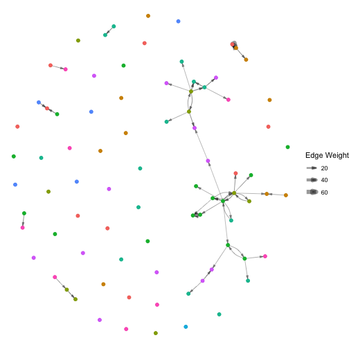

Example script analyzing the MIT Social Evolution data with `R`'s `goldfish` package. 
Models inspired by section 7 of:

> Stadtfeld & Block (2017), "Interactions, Actors and Time: Dynamic Network Actor Models for Relational Events", Sociological Science, 2017, 4(1): 318-352. DOI: 10.15195/v4.a14

# Step 0: Load package and data

First, we load the `goldfish` package and load the data. 
The data is loaded using lazy loading, i.e., the objects are only 'promised' for the moment, but are available in the environment to be used, and more information will appear as you use them. 
You can find out more about this dataset, its format, and its origins in a couple of ERGM papers by callings its documentation:


```r
library(goldfish)
data("Social_Evolution")
# ?Social_Evolution
head(calls)
#>         time   sender receiver increment
#> 1 1220733470 Actor 72 Actor 50         1
#> 2 1221102974 Actor 43 Actor 51         1
#> 3 1221784293 Actor 43 Actor 51         1
#> 4 1221785882 Actor 43 Actor 22         1
#> 5 1221787264 Actor 43 Actor 55         1
#> 6 1221848443 Actor 43 Actor 51         1
head(actors)
#>     label present floor gradeType
#> 1 Actor 1    TRUE     3         5
#> 2 Actor 2    TRUE     5         1
#> 3 Actor 3    TRUE     5         2
#> 4 Actor 4    TRUE     2         2
#> 5 Actor 5    TRUE     4         1
#> 6 Actor 6    TRUE     4         2
```


# Preamble: Run a quick DyNAM in five lines
We use `R` version 4.2.0 to compile the vignettes.
The native pipe operator is available in `R` from version 4.1.0.


```r
callNetwork <- defineNetwork(nodes = actors, directed = TRUE) |> # 1
  linkEvents(changeEvent = calls, nodes = actors) # 2

# 3
callsDependent <- defineDependentEvents(
  events = calls, nodes = actors,
  defaultNetwork = callNetwork
  )

# 4
mod00Rate <- estimate(
  callsDependent ~ indeg + outdeg,
  model = "DyNAM", subModel = "rate"
  )
```

 

```
#> Error in value[[3L]](cond): Unknown effect indeg

summary(mod00Rate)
#> Error in summary(mod00Rate): object 'mod00Rate' not found

mod00Choice <- estimate(
  callsDependent ~ inertia + recip + trans,
  model = "DyNAM", subModel = "choice"
  )
```

 

```
#> Error in value[[3L]](cond): Unknown effect inertia

summary(mod00Choice)
#> Error in summary(mod00Choice): object 'mod00Choice' not found
```

# Step 1: Create data objects

## Step 1a: Define node set(s) and attributes

We've loaded a dataset that defines its nodes and their attributes as a data frame. Let's check what we have first.


```r
class(actors)
#> [1] "data.frame"
head(actors)
#>     label present floor gradeType
#> 1 Actor 1    TRUE     3         5
#> 2 Actor 2    TRUE     5         1
#> 3 Actor 3    TRUE     5         2
#> 4 Actor 4    TRUE     2         2
#> 5 Actor 5    TRUE     4         1
#> 6 Actor 6    TRUE     4         2
```

Note that there are four column variables: `label` the identifier, `present`, the `floor` of residence, and `gradeType` their educational level (1 = freshmen to 5 = graduate). All of these columns will be recognized as individual attributes by goldfish.

We need to define them as nodes so that `goldfish` knows what to do with them.


```r
actors <- defineNodes(actors)
actors
#> Number of nodes: 84 
#> Number of present nodes: 84 
#> 
#> First 6 rows
#>     label present floor gradeType
#> 1 Actor 1    TRUE     3         5
#> 2 Actor 2    TRUE     5         1
#> 3 Actor 3    TRUE     5         2
#> 4 Actor 4    TRUE     2         2
#> 5 Actor 5    TRUE     4         1
#> 6 Actor 6    TRUE     4         2
```

As you can see, the structure is the same, so we can still treat it like a data frame, but the added class helps goldfish interpret the data frame correctly.

At any time, we can also check what goldfish-defined objects we have in our environment using the following function:


```r
goldfishObjects()
#> Goldfish Nodes
#>               n                       attributes               events
#> actors       84 label, present, floor, gradeType                     
#> endStates   154      label, present, regime, gdp present, regime, gdp
#> startStates 154      label, present, regime, gdp present, regime, gdp
#> states      154      label, present, regime, gdp present, regime, gdp
#> 
#> Goldfish Networks
#>                   dimensions nodesets        events
#> bilatnet           154 x 154   states  bilatchanges
#> callNetwork          84 x 84   actors         calls
#> contignet          154 x 154   states contigchanges
#> friendshipNetwork    84 x 84   actors    friendship
#> 
#> Goldfish Dependent Events
#>                  n     network
#> callsDependent 439 callNetwork
#> createBilat     69    bilatnet
```

## Step 1b: Define networks

Next we want to define the dyadic or network elements: calls between our actors.


```r
head(calls)
#>         time   sender receiver increment
#> 1 1220733470 Actor 72 Actor 50         1
#> 2 1221102974 Actor 43 Actor 51         1
#> 3 1221784293 Actor 43 Actor 51         1
#> 4 1221785882 Actor 43 Actor 22         1
#> 5 1221787264 Actor 43 Actor 55         1
#> 6 1221848443 Actor 43 Actor 51         1
```

Note there are columns for `time`, `sender`, and `receiver`. `increment` is a reserved column.

To tell goldfish this is a network, we must define it as such:

```r
?defineNetwork
```


```r
callNetwork <- defineNetwork(nodes = actors, directed = TRUE)
```

The argument `directed` is `TRUE` by default, but we need to specify the nodes so that `goldfish` can check for consistency and relate it to that nodeset as needed.


```r
callNetwork
#> Dimensions: 84 84 
#> Number of ties (no weighted): 0 
#> Nodes set(s): actors 
#> It is a one-mode and directed network
#> 
#> First 6 rows and columns
#>          receiver
#> sender    Actor 1 Actor 2 Actor 3 Actor 4 Actor 5 Actor 6
#>   Actor 1       0       0       0       0       0       0
#>   Actor 2       0       0       0       0       0       0
#>   Actor 3       0       0       0       0       0       0
#>   Actor 4       0       0       0       0       0       0
#>   Actor 5       0       0       0       0       0       0
#>   Actor 6       0       0       0       0       0       0
```

Note that we have not added any network data yet. By default, `defineNetwork()` just constructs an empty matrix with dimensions defined by the length of the nodeset(s). 
So we have an empty network as a starting state.

Now that goldfish recognizes the matrix as a network, we can also associate an event list that updates it. 
To do this we use the `linkEvents()` function, which requires us to identify a goldfish object to be updated, the events that update it and, in this case, also the nodes that the events should relate to. 
`goldfish` checks the consistency of all this information and relates these objects to one another so that information can be called as needed.


```r
?linkEvents
```


```r
callNetwork <- linkEvents(x = callNetwork, changeEvent = calls, nodes = actors)
callNetwork
#> Dimensions: 84 84 
#> Number of ties (no weighted): 0 
#> Nodes set(s): actors 
#> It is a one-mode and directed network
#> Linked events: calls 
#> 
#> First 6 rows and columns
#>          receiver
#> sender    Actor 1 Actor 2 Actor 3 Actor 4 Actor 5 Actor 6
#>   Actor 1       0       0       0       0       0       0
#>   Actor 2       0       0       0       0       0       0
#>   Actor 3       0       0       0       0       0       0
#>   Actor 4       0       0       0       0       0       0
#>   Actor 5       0       0       0       0       0       0
#>   Actor 6       0       0       0       0       0       0
```

### Task

You should now be able to do the same with the friendship nomination network/event list. 
See the familiar columns `time`, `sender`, and `receiver`. 
The new column, `replace`, is an alternative treatment to `increment`. 
When an event occurs, goldfish will replace the value in the relevant cell with the value in this column instead of incrementing it. 
Friendship is thus a binary network.


```r
head(friendship)
#>         time   sender receiver replace
#> 1 1220918400 Actor 47  Actor 2       1
#> 3 1220918400 Actor 57  Actor 2       1
#> 4 1220918400  Actor 9 Actor 38       1
#> 5 1220918400 Actor 68 Actor 40       1
#> 6 1220918400 Actor 23 Actor 40       1
#> 7 1220918400 Actor 49 Actor 40       1
friendshipNetwork <- defineNetwork(nodes = actors, directed = TRUE)
friendshipNetwork <- linkEvents(
  x = friendshipNetwork, 
  changeEvents = friendship, 
  nodes = actors
  )
friendshipNetwork
#> Dimensions: 84 84 
#> Number of ties (no weighted): 0 
#> Nodes set(s): actors 
#> It is a one-mode and directed network
#> Linked events: friendship 
#> 
#> First 6 rows and columns
#>          receiver
#> sender    Actor 1 Actor 2 Actor 3 Actor 4 Actor 5 Actor 6
#>   Actor 1       0       0       0       0       0       0
#>   Actor 2       0       0       0       0       0       0
#>   Actor 3       0       0       0       0       0       0
#>   Actor 4       0       0       0       0       0       0
#>   Actor 5       0       0       0       0       0       0
#>   Actor 6       0       0       0       0       0       0
```

## Step 1c: Define dependent events

The final step in defining the data objects is to identify the dependent events. 
Here we would like to model as the dependent variable the calls between individuals. 
We specify the event list and the node list.


```r
?defineDependentEvents
```


```r
callsDependent <- defineDependentEvents(
  events = calls, nodes = actors,
  defaultNetwork = callNetwork
  )
callsDependent
#> Number of events: 439 
#> Nodes set(s): actors 
#> Default network: callNetwork 
#> 
#> First 6 rows
#>         time   sender receiver increment
#> 1 1220733470 Actor 72 Actor 50         1
#> 2 1221102974 Actor 43 Actor 51         1
#> 3 1221784293 Actor 43 Actor 51         1
#> 4 1221785882 Actor 43 Actor 22         1
#> 5 1221787264 Actor 43 Actor 55         1
#> 6 1221848443 Actor 43 Actor 51         1
```

### Intermediate step: Visualization

While not a required part of the modeling process, we highly recommend the visualization of your data for analytic and diagnostic purposes. 
`goldfish` includes wrappers for base `R` commands to help extract monadic and dyadic information for certain time points, `?as.data.frame.nodes.goldfish` and `?as.matrix.network.goldfish` .

We can use these functions to visually compare our network at two (or more) different time periods using `migraph`. See the `migraph` package documentation for additional information about network visualization. 


```r
library(ggraph)
library(migraph)
# The network at the beginning
callNetworkBgn <- as.matrix(callNetwork)
autographr(callNetworkBgn, labels = FALSE, layout = "fr")
```


```r

# The network at half time
callNetworkHlf <- as.matrix(callNetwork,
                            time = calls$time[floor(nrow(calls) / 2)]) |> 
  add_node_attribute("floor", actors$floor)

autographr(callNetworkHlf, labels = FALSE, layout = "fr") +
  geom_node_point(aes(color = as.factor(floor)), size = 2, show.legend = FALSE)
```



```r

# The network at the end
callNetworkEnd <- as.matrix(callNetwork, time = max(calls$time) + 1) |> 
  add_node_attribute("floor", actors$floor)

autographr(callNetworkEnd, labels = FALSE, layout = "fr") +
  geom_node_point(aes(color = as.factor(floor)), size = 2, show.legend = FALSE)
```


```r


# The tie strength at the end
table(as.matrix(callNetwork, time = max(calls$time) + 1))
#> 
#>    0    1    2    3    4    6    7    8    9   10   11   13   15   64  115 
#> 6972   36   13   10    8    1    5    3    1    1    1    2    1    1    1
```

# Step 2: Specify and estimate model

The second step is to specify and fit a model to this data. 
This step can be broken up into several stages:

-   **Step 2a**. *Formula*: Specify a model formula from the effects and variables available

-   **Step 2b**. *Preprocessing*: Calculate the change statistics associated with these effects

-   **Step 2c**. *Estimation*: Fit an appropriate model to these statistics

However, in goldfish we also have the option of accelerating this process and using memory more efficiently by combining these three sub-steps in one. 
Nonetheless, it can be helpful to think of 2a separately, and recognize steps 2b and 2c as goldfish does them.

## Step 2a. Formula

We specify our model using the standard R formula format like:

`goldfish_dependent ~ effects(process_state_element)`

We can see which effects are currently available and how to specify them here:


```r
vignette("goldfishEffects")
```

Let's start with the simplest model we can imagine:


```r
simpleFormulaChoice <- callsDependent ~ tie(friendshipNetwork)
```

What are we testing here? 
Do individuals call their friends more than non-friends?

## Step 2b and 2c. Preprocessing and Estimation

Now to estimate this model, we use the `?estimate` function. 
For now, only need to worry about the `formula` and the `model`, `subModel` type (DyNAM-choice).


```r
mod01Choice <- estimate(
  simpleFormulaChoice,
  model = "DyNAM", subModel = "choice"
  )
```

 

```
#> Error in value[[3L]](cond): Unknown effect tie
summary(mod01Choice)
#> Error in summary(mod01Choice): object 'mod01Choice' not found
```

Ok, as fascinating as that was, perhaps we can test how robust this finding is in the presence of plausible controls.


```r
complexFormulaChoice <-
  callsDependent ~ inertia(callNetwork) + recip(callNetwork) +
                   tie(friendshipNetwork) + recip(friendshipNetwork) +
                   same(actors$gradeType) + same(actors$floor)

mod02Choice <- estimate(
  complexFormulaChoice,
  model = "DyNAM", subModel = "choice"
  )
```

 

```
#> Error in value[[3L]](cond): Unknown effect inertia
summary(mod02Choice)
#> Error in summary(mod02Choice): object 'mod02Choice' not found
```

### Rate model

How do individual properties affect the rate of action of individuals? (Step 1 of the model)

Let us again define a simple formula that only depends on individuals' degree in the friendship network


```r
simpleFormulaRate <- callsDependent ~ indeg(friendshipNetwork)
mod01Rate <- estimate(
  simpleFormulaRate,
  model = "DyNAM", subModel = "rate"
  )
```

 

```
#> Error in value[[3L]](cond): Unknown effect indeg
```

#### Remark:

Sometimes, the default values for the algorithm are not enough to reach convergence. 
We can remedy this by increasing the number of iterations:


```r
mod01Rate <- estimate(
  simpleFormulaRate, 
  model = "DyNAM", subModel = "rate",
  estimationInit = list(maxIterations = 40)
  )
```

 

```
#> Error in value[[3L]](cond): Unknown effect indeg
summary(mod01Rate)
#> Error in summary(mod01Rate): object 'mod01Rate' not found
```

What if we include additional structural effects? 
Let us add the in and out degree of the nodes in the call network


```r
complexFormulaRate <- 
  callsDependent ~ indeg(callNetwork) + outdeg(callNetwork) + 
                   indeg(friendshipNetwork) 

mod02Rate <- estimate(complexFormulaRate, model = "DyNAM", subModel = "rate")
```

 

```
#> Error in value[[3L]](cond): Unknown effect indeg
summary(mod02Rate)
#> Error in summary(mod02Rate): object 'mod02Rate' not found
```

#### Right-censored intervals

Recall that it is important to add a time intercept when estimating models with
right-censored intervals (as discussed in Stadtfeld & Block, 2017). 
Adding an intercept is as easy as including a 1 to the formula:


```r
interceptFormulaRate <-
  callsDependent ~ 1 + indeg(callNetwork) + outdeg(callNetwork) +
                   indeg(friendshipNetwork)

mod03Rate <- estimate(interceptFormulaRate, model = "DyNAM", subModel = "rate")
```

 

```
#> Error in value[[3L]](cond): Unknown effect indeg
summary(mod03Rate)
#> Error in summary(mod03Rate): object 'mod03Rate' not found
```

Note that $1 / \exp({\beta_{intercept}})$ is the waiting time without any covariates, or how long it takes to make the next phone call if everything else is set to 0. 
Therefore, the larger the intercept the shorter the waiting time. 
For example, an intercept of -14 means a waiting time of $1 / e^{-14} = 334$ hours. 
The baseline waiting time between two events in hours:


```r
mod03RateCoef <- coef(mod03Rate)
#> Error in coef(mod03Rate): object 'mod03Rate' not found
1 / exp(mod03RateCoef[["Intercept"]]) / 3600
#> Error in eval(expr, envir, enclos): object 'mod03RateCoef' not found
# or days:
1 / exp(mod03RateCoef[["Intercept"]]) / 86400
#> Error in eval(expr, envir, enclos): object 'mod03RateCoef' not found

# But what if it is not just a random call?
# Expected waiting time of those who have five outgoing call ties (five different actors)
1 / exp(
  mod03RateCoef[["Intercept"]] + mod03RateCoef[["outdeg"]] * 5
  ) / 3600
#> Error in eval(expr, envir, enclos): object 'mod03RateCoef' not found
# Expected waiting time of those who have five outgoing and incoming call ties (five different actors)
1 / exp(
  mod03RateCoef[["Intercept"]] +
    mod03RateCoef[["outdeg"]] * 5 +
    mod03RateCoef[["indeg"]] * 5
  ) / 3600
#> Error in eval(expr, envir, enclos): object 'mod03RateCoef' not found
```

### Windows

Remember our `callNetwork` process state accumulates actions in time, but some older actions may no longer be relevant to current action. 
Let's see whether it is really just recent partners that matter by adding extra effects with a window of... how long? 
Let us try 5 minutes $= 5 * 60 = 300s$


```r
windowFormulaRate <-
  callsDependent ~ 1 + indeg(callNetwork) + outdeg(callNetwork) +
                   indeg(callNetwork, window = 300) +
                   outdeg(callNetwork, window = 300) +
                   indeg(friendshipNetwork)

mod04Rate <- estimate(windowFormulaRate, model = "DyNAM", subModel = "rate")
```

 

```
#> Error in value[[3L]](cond): Unknown effect indeg
summary(mod04Rate)
#> Error in summary(mod04Rate): object 'mod04Rate' not found
```

Of course, you can also add windows to the choice formula!


```r
windowFormulaChoice <-
  callsDependent ~ inertia(callNetwork) + recip(callNetwork) +
                   inertia(callNetwork, window = 300) +
                   recip(callNetwork, window = 300) +
                   tie(friendshipNetwork) + recip(friendshipNetwork) +
                   same(actors$gradeType) + same(actors$floor)

mod03Choice <- estimate(windowFormulaChoice,
                         model = "DyNAM", subModel = "choice")
```

 

```
#> Error in value[[3L]](cond): Unknown effect inertia
summary(mod03Choice)
#> Error in summary(mod03Choice): object 'mod03Choice' not found
```

All this shows you that you can specify different formula for the rate and choice components of the model. 
This is a key advantage of the DyNAM!

When comparing the information criteria (AIC / BIC) of the different model, we see that the time windows explain a lot


```r
AIC(mod02Choice)
#> Error in AIC(mod02Choice): object 'mod02Choice' not found
AIC(mod03Choice)
#> Error in AIC(mod03Choice): object 'mod03Choice' not found
AIC(mod03Rate)
#> Error in AIC(mod03Rate): object 'mod03Rate' not found
AIC(mod04Rate)
#> Error in AIC(mod04Rate): object 'mod04Rate' not found
```

### REM with `goldfish`

`goldfish` does not only run DyNAMs; it also runs REMs (Butts, 2008).
We can now also run REMs using the right-censored intervals as introduced in Stadtfeld & Block (2017).


```r
allFormulaREM <-
  callsDependent ~ 1 + inertia(callNetwork) + recip(callNetwork) +
                   inertia(callNetwork, window = 300) +
                   recip(callNetwork, window = 300) +
                   tie(friendshipNetwork) + recip(friendshipNetwork) +
                   same(actors$gradeType) + same(actors$floor)
```

And we can estimate this model, to speed up estimation, we can use any of the two `C` implementations of the estimation algorithm.
Setting the option `engine` on the `estimationInit` argument, we can choose which version of the `C` code to use.
`"default_c"` implements the same algorithm as the default one implemented in plain `R` code that reduces the memory use by exploiting the sparsity of the dyads that change the effects' statistics after each event.
`"gather_compute"` implements a version with an overhead of memory use, representing the data in a more usual tabular way but reducing time estimation.


```r
mod01REM <- estimate(
  allFormulaREM, model = "REM",
  estimationInit = list(engine = "gather_compute")
  )

```


```r
mod01REM <- estimate(
  allFormulaREM, model = "REM",
  estimationInit = list(initialDamping = 40, engine = "default_c")
  )
```

 

```
#> Error in value[[3L]](cond): Unknown effect inertia

summary(mod01REM)
#> Error in summary(mod01REM): object 'mod01REM' not found
```

