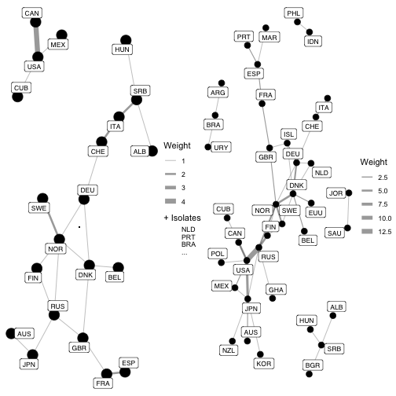

Example script prepared analyzing the Fisheries Agreements data with
the `R` `goldfish` package.
Models inspired by section 7 of:

> Stadtfeld, Hollway & Block (2017),
> "Dynamic Network Actor Models: Investigating Coordination Ties through Time",
> Sociological Methodology, 2017, 47(1): 1-40. DOI: 10.1177/0081175017709295

# Step 0: Load package and data

First, let's take the goldfish out of the bowl:


``` r
library(goldfish)
```

`goldfish` consumes a **single data object**: a `stocnet` that bundles the node
set, the network layers, and the attribute changes together. The Fisheries
Agreements study ships prebuilt in that shape as `fisheries_treaties`:


``` r
data("fisheries_treaties")
# ?fisheries_treaties
fisheries_treaties
#> 
#> ── # Fisheries Treaties ────────────────────────────────────────────────────────
#> # A dynamic, labelled, multiplex, signed, weighted, undirected network of 154
#> nodes and 413 treaties ties and 413 contiguity ties from 1960-03-19 to
#> 1969-12-09
#> 
#> ── Nodes
#> # A tibble: 154 × 4
#>   label active regime      gdp
#>   <chr> <lgl>   <dbl>    <dbl>
#> 1 AND   TRUE       NA NA      
#> 2 DNK   TRUE       10  0.00625
#> 3 FRA   TRUE        5  0.0627 
#> 4 DEU   TRUE       -9 NA      
#> # ℹ 150 more rows
#> 
#> ── Changes
#> # A tibble: 1,186 × 4
#>   time                 node var        value
#>   <dttm>              <int> <chr>     <list>
#> 1 1960-01-02 00:00:00    86 regime   -1<dbl>
#> 2 1960-01-16 00:00:00    48 regime   NA<dbl>
#> 3 1960-01-16 00:00:00    89 regime   -8<dbl>
#> 4 1960-04-03 00:00:00   109 active TRUE<lgl>
#> # ℹ 1,182 more rows
#> 
#> ── Ties
#> # A tibble: 413 × 6
#>    from    to weight time                layer    order
#>   <int> <int>  <dbl> <dttm>              <chr>    <int>
#> 1     2     4      1 NA                  treaties    NA
#> 2     2     7      1 1968-05-30 00:00:00 treaties    NA
#> 3     2    12      1 1967-12-05 00:00:00 treaties    NA
#> 4     2    15      1 NA                  treaties    NA
#> # ℹ 409 more rows
#> 
```

The object carries two undirected **layers** over 154 state nodes: `treaties`,
the bilateral fisheries agreements (the layer we model -- named as the dependent
in each specification's `layer` below, and recorded as the optional default
**focal** layer), and `contiguity`, whether states border one another. The states carry three dynamic
attributes -- `active` (sovereign status), `regime`, and `gdp` -- in the
`changes` component.

The treaty layer is special: signing a treaty and ending one are different
processes, and we will want to model them separately. Note what the `increment`
updates actually do here -- states sign with the same partner again and again
(Russia and the USA sign fourteen times over five years, against a single
ending), so the tie **counts treaties** rather than recording whether one
exists. We come back to this in Step 3, because it decides how the two
processes must be declared.

# Step 1: How the data object is built

The prebuilt object was assembled from the raw frames that ship as
`Fisheries_Treaties_6070`. Understanding that workflow lets you bring your own
data into `goldfish`; everything here uses `manynet`, which owns the `stocnet`
structure.


``` r
library(manynet)
data("Fisheries_Treaties_6070")
```

## Step 1a: A network from history and events

Since international fisheries management began before 1960, several bilateral
agreements were already in place at the start of the study period. That initial
state is the `bilatnet` **adjacency matrix**; the `bilatchanges` event list then
creates and dissolves ties over time.

`as_stocnet()` reads the matrix into a single-layer `stocnet`. Its ties enter
with **`time = NA`** -- the convention for *history*, ties that hold before the
observation window and seed the starting state rather than being modeled as
events. `bind_ties()` then appends the timed events.


``` r
treaties <- as_stocnet(bilatnet) |> # bilatnet -> history ties (time = NA)
  join_nodes(states) |>
  rename_nodes() |>
  bind_ties(bilatchanges)
#> Joining with `by = join_by(label)`
```

The contiguity layer is built the same way. Its `replace` events include
same-time, same-dyad rows (a border set and then cleared at one timestamp);
because merging a `stocnet` does not preserve the incoming row order, we add an
integer **`order`** column so that sequence is an unambiguous tie-break.


``` r
contigchanges$order <- seq_len(nrow(contigchanges))
contiguity <- as_stocnet(contignet) |>
  bind_ties(contigchanges)
```

## Step 1b: Merge the layers and add the covariates

`from_ties()` merges the layers over one node set; `add_info()` records the
`directed` flags, each layer's `observation` type, and -- optionally -- a
default `focal` layer (each specification names its dependent through `layer`,
so `focal` is just a default); and `bind_changes()` attaches the dynamic node
attributes.


``` r
fisheries_built <- from_ties(
  treaties = treaties,
  contiguity = contiguity
) |>
  add_info(
    name = "Fisheries Treaties",
    # focal is optional -- the specifications below name "treaties" via `layer`.
    focal = "treaties",
    directed = c(treaties = FALSE, contiguity = FALSE),
    observation = c(treaties = "event", contiguity = "event")
  ) |>
  bind_changes(changes = gdpchanges, var = "gdp") |>
  bind_changes(sovchanges, var = "active") |>
  bind_changes(regchanges, var = "regime")
```

This reproduces the shipped `fisheries_treaties`, so the rest of the vignette
uses the prebuilt object.

# Intermediate step: Visualisation

While not a required part of the modeling process,
we highly recommend the visualisation of your data
for analytic and diagnostic purposes.

`goldfish` exports `network_state_at()` and `nodes_state_at()` to evaluate a
layer's network -- and the node attributes -- at a time point, honoring the
`time = NA` history and each layer's update semantics.


``` r
library(igraph)
library(migraph)
library(patchwork)

start_time <- as.POSIXct("1960-01-02")
end_time <- as.POSIXct("1970-01-01")

# network and attributes at the beginning of the event sequence
startStates <- nodes_state_at(fisheries_treaties, time = start_time)
startNet <- network_state_at(fisheries_treaties, "treaties", time = start_time) |>
  as_igraph() |>
  add_node_attribute("present", startStates$active) |>
  add_node_attribute("regime", startStates$regime) |>
  add_node_attribute("gdp", startStates$gdp)

# network and attributes at the end of the event sequence
endStates <- nodes_state_at(fisheries_treaties, time = end_time)
endNet <- network_state_at(fisheries_treaties, "treaties", time = end_time) |>
  as_igraph() |>
  add_node_attribute("present", endStates$active) |>
  add_node_attribute("regime", endStates$regime) |>
  add_node_attribute("gdp", endStates$gdp)

# logical value indicating if states were present and with agreements
isStateActive <-
  (startStates$active & degree(startNet) > 0) |
  (endStates$active & degree(endNet) > 0)

# subset networks to active states
startNet <- delete_vertices(startNet, which(!isStateActive))
endNet <- delete_vertices(endNet, which(!isStateActive))

graphr(startNet, layout = "fr") | graphr(endNet, layout = "fr")
```

<div class="figure" style="text-align: center">

<p class="caption">plot of chunk plot-teaching2</p>
</div>

What can we observe?

# Step 2: Specify and estimate model

The second step is to specify and fit a model to this data.
This step can be broken up into several stages:

- Step 2a. Specify a model formula from the effects and variables available
- Step 2b. Calculate the change statistics associated with these effects
- Step 2c. Fit an appropriate model to these statistics

However, in goldfish we also have the option of accelerating this process
and using memory more efficiently by combining these three sub-steps in one.

Let us first see how to specify the effects and which are currently available:


``` r
vignette("goldfishEffects")
```

Since treaty ending is a rarer, more complex, and idiosyncratic process, we
model only the events that **sign** a treaty.

First we name the two processes with `add_flavor()`, which maps the layer's
update values onto flavor names and records how those flavors relate. This is
where the counting matters. `flavor_style = "redundant"` says repeated
same-direction events are meaningful -- exactly what signing again with the same
partner is -- so neither process gets a support constraint. The alternative,
`"mutually_exclusive"`, would mean a treaty can only be signed where none
exists and only ended where one does; declare that here and goldfish warns you,
naming a signing that lands on a dyad which already has treaties.


``` r
fisheries_treaties <- add_flavor(
  fisheries_treaties,
  layer = "treaties",
  values_equivalence = c(signing = 1, ending = -1),
  flavor_style = "redundant"
)
```

Modeling one process is then a one-liner: pass `rate`/`choice` a **flavor-keyed
list** whose formula left-hand side is the flavor to model. Only `"signing"`
rows become dependent events, while the `"ending"` rows still update the network
state.

An effect's argument names a **layer** (`treaties`, `contiguity`) or a **node
attribute** (`regime`, `gdp`) by its bare name.
The data and model specification is similar (though not the same as)
Stadtfeld, Hollway, and Block 2017a.


``` r
formula1 <- list(
  signing ~ inertia(treaties) + indeg(treaties) + trans(treaties) +
    tie(contiguity) +
    alter(regime) + diff(regime) +
    alter(gdp) + diff(gdp)
)

partnerSpec <- make_specification(
  choice = formula1,
  model = "DyNAM",
  choice_sub_model = "choice_coordination",
  layer = "treaties",
  data = fisheries_treaties
)

est_opts <- set_algorithm_newton(
  return_interval_loglik = TRUE,
  initial_damping = 40,
  max_iterations = 30,
  engine = "default"
)

system.time(
  partnerModel <- estimate_dynam(
    partnerSpec,
    sub_model = "choice_coordination",
    data = fisheries_treaties,
    control_algo = est_opts
  )
)
#> Warning: ℹ Missing data has been detected. The mean is used to impute numeric
#>   attributes.
#> ℹ Missing data has been detected. The mean is used to impute numeric
#>   attributes.
#>    user  system elapsed 
#>   9.596   0.406   8.945
```

Did the model converge? If not, you can restart the estimation process using
the same specification and current parameter estimates:


``` r
est_opts <- set_algorithm_newton(
  return_interval_loglik = TRUE,
  initial_damping = 40,
  max_iterations = 30,
  initial_parameters = coef(partnerModel),
  engine = "default"
)

partnerModel <- estimate_dynam(
  partnerSpec,
  sub_model = "choice_coordination",
  data = fisheries_treaties,
  control_algo = est_opts
)
#> Warning: ℹ Missing data has been detected. The mean is used to impute numeric
#>   attributes.
#> ℹ Missing data has been detected. The mean is used to impute numeric
#>   attributes.
summary(partnerModel)
#> 
#> Call:
#> estimate_dynam(treaties ~ inertia(treaties) + indeg(treaties) + 
#>     trans(treaties) + tie(contiguity) + alter(regime) + diff(regime) + 
#>     alter(gdp) + diff(gdp))
#> 
#> 
#> Coefficients:
#>                     Estimate  Std. Error z-value  Pr(>|z|)    
#> inertia/treaties  1.71765358  0.21473668  7.9989 1.332e-15 ***
#> indeg/treaties    0.48087519  0.06171279  7.7921 6.661e-15 ***
#> trans/treaties    0.41281091  0.14605692  2.8264  0.004708 ** 
#> tie/contiguity   -0.66415255  2.56015462 -0.2594  0.795312    
#> alter/regime     -0.00099302  0.01561441 -0.0636  0.949292    
#> diff/regime      -0.01768437  0.01209465 -1.4622  0.143696    
#> alter/gdp        -0.86883615  1.40668605 -0.6176  0.536808    
#> diff/gdp          2.91200131  1.51004342  1.9284  0.053803 .  
#> ---
#> Signif. codes:  0 '***' 0.001 '**' 0.01 '*' 0.05 '.' 0.1 ' ' 1
#> 
#>   Return code 1: gradient close to zero
#>     score (rel. norm): 8.88e-07    step (max|update|): 9.42e-06
#>   8 parameters estimated  
#>   Log-Likelihood: -379.33
#>   AIC:  774.66 
#>   AICc: 777.06 
#>   BIC:  792.53 
#>   model: "DyNAM" sub_model: "choice_coordination"
```

Let's interpret...
- Do states prefer partners with more partners?
- Do states prefer partners that are contiguous?
- Does transitivity matter?
- Do states prefer rich or democratic partners?
- Do states prefer similarly rich or democratic partners?


``` r
formula2 <- list(
  signing ~ inertia(treaties, weighted = TRUE) +
    indeg(treaties) + trans(treaties) +
    tie(contiguity) + alter(regime) +
    diff(regime) + alter(gdp) + diff(gdp)
)

tieSpec <- make_specification(
  choice = formula2,
  model = "DyNAM",
  choice_sub_model = "choice_coordination",
  layer = "treaties",
  data = fisheries_treaties
)

est_opts <- set_algorithm_newton(
  return_interval_loglik = TRUE,
  initial_damping = 40,
  max_iterations = 30
)

system.time(
  tieModel <- estimate_dynam(
    tieSpec,
    sub_model = "choice_coordination",
    data = fisheries_treaties,
    control_algo = est_opts
  )
)
#> Warning: ℹ Missing data has been detected. The mean is used to impute numeric
#>   attributes.
#> ℹ Missing data has been detected. The mean is used to impute numeric
#>   attributes.
#>    user  system elapsed 
#>   3.554   0.176   3.409
```

# Extensions...

In the most recent version of `{goldfish}`,
you will find some functions still under development.

One set of functions is to help integrate the results of `{goldfish}` models
with the wider world of statistical modeling.

We have implemented some "tidymodels" (or rather `{broom}`) functions
for extracting and printing the key results from goldfish results objects.
Here is an example on the current results object:


``` r
library(broom)
library(pixiedust)
dust(tidy(tieModel, conf.int = TRUE)) |>
  sprinkle(col = c(2:4, 6, 7), round = 3) |>
  sprinkle(col = 5, fn = quote(pvalString(value)))
#>                 term estimate std.error statistic p.value conf.low conf.high
#> 1 inertia_treaties_W    0.282     0.049     5.768 < 0.001    0.186     0.378
#> 2     indeg_treaties    0.574     0.057    10.062 < 0.001    0.462     0.686
#> 3     trans_treaties    0.451     0.134     3.368 < 0.001    0.189     0.714
#> 4     tie_contiguity    -0.64     2.729    -0.235    0.81   -5.989     4.709
#> 5       alter_regime    0.004     0.016     0.268    0.79   -0.027     0.035
#> 6        diff_regime   -0.014     0.012    -1.219    0.22   -0.037     0.009
#> 7          alter_gdp    1.294     1.348     0.959    0.34   -1.349     3.937
#> 8           diff_gdp    0.065     1.426     0.045    0.96    -2.73     2.859
```


``` r
glance(tieModel)
#> # A tibble: 1 × 5
#>   logLik   AIC   BIC    df  nobs
#>    <dbl> <dbl> <dbl> <int> <int>
#> 1  -398.  812.  830.     8    69
```


Lastly, we have begun implementing further diagnostic functions that can
help users identify areas for improving their model specification.


``` r
diagnose_outliers(tieModel)
#> Identified 0 Outliers(s):
#> # A tibble: 69 × 8
#>    time                sender receiver increment rightCensoredEvent intervalLogL
#>    <dttm>              <chr>  <chr>        <dbl> <lgl>                     <dbl>
#>  1 1960-03-19 00:00:00 FIN    SWE              1 FALSE                     -7.52
#>  2 1960-06-23 00:00:00 FIN    RUS              1 FALSE                     -5.21
#>  3 1960-11-15 00:00:00 FIN    NOR              1 FALSE                     -3.40
#>  4 1960-11-17 00:00:00 GBR    NOR              1 FALSE                     -3.78
#>  5 1961-03-11 00:00:00 GBR    ISL              1 FALSE                     -8.16
#>  6 1961-07-19 00:00:00 DEU    ISL              1 FALSE                     -8.41
#>  7 1961-07-19 00:00:00 DEU    ISL              1 FALSE                     -8.41
#>  8 1961-08-01 00:00:00 DNK    ISL              1 FALSE                     -5.73
#>  9 1962-01-23 00:00:00 BGR    SRB              1 FALSE                     -9.32
#> 10 1962-02-22 00:00:00 NOR    RUS              1 FALSE                     -4.62
#> # ℹ 59 more rows
#> # ℹ 2 more variables: label <chr>, outlier <lgl>
diagnose_changepoints(tieModel)
#> Identified 8 Change Point(s):
#> # A tibble: 69 × 7
#>    time                sender receiver increment rightCensoredEvent intervalLogL
#>    <dttm>              <chr>  <chr>        <dbl> <lgl>                     <dbl>
#>  1 1960-03-19 00:00:00 FIN    SWE              1 FALSE                     -7.52
#>  2 1960-06-23 00:00:00 FIN    RUS              1 FALSE                     -5.21
#>  3 1960-11-15 00:00:00 FIN    NOR              1 FALSE                     -3.40
#>  4 1960-11-17 00:00:00 GBR    NOR              1 FALSE                     -3.78
#>  5 1961-03-11 00:00:00 GBR    ISL              1 FALSE                     -8.16
#>  6 1961-07-19 00:00:00 DEU    ISL              1 FALSE                     -8.41
#>  7 1961-07-19 00:00:00 DEU    ISL              1 FALSE                     -8.41
#>  8 1961-08-01 00:00:00 DNK    ISL              1 FALSE                     -5.73
#>  9 1962-01-23 00:00:00 BGR    SRB              1 FALSE                     -9.32
#> 10 1962-02-22 00:00:00 NOR    RUS              1 FALSE                     -4.62
#> # ℹ 59 more rows
#> # ℹ 1 more variable: cpt <lgl>
```

For more, please see Hollway (2020) Network Embeddedness and
the Rate of Water Cooperation and Conflict.
