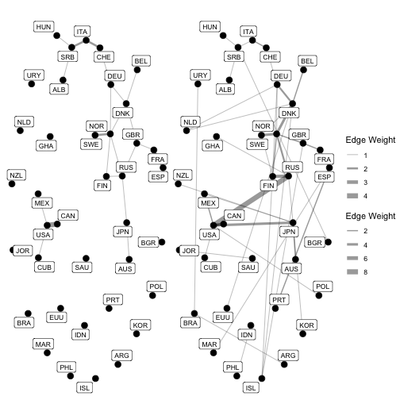

Example script prepared analyzing the Fisheries Agreements data with
the `R` `goldfish` package.
Models inspired by section 7 of:

> Stadtfeld, Hollway & Block (2017),
> "Dynamic Network Actor Models: Investigating Coordination Ties through Time",
> Sociological Methodology, 2017, 47(1): 1-40. DOI: 10.1177/0081175017709295

# Step 0: Load package and data

First, let's make sure we're starting with a clean slate and take
the goldfish out of the bowl:


``` r
library(goldfish)
```

This lazy loads several datasets, including the one we will now use:


``` r
data("Fisheries_Treaties_6070")
# ?Fisheries_Treaties_6070
```

Note that these objects are only 'promised' for the moment,
but are available in the environment to be used,
and more information will appear as you use them.
You can find out more about this dataset, its format,
and its origins in a couple of ERGM papers by calling its documentation.

# Step 1: Create data objects ####

## Step 1a: Define node set(s) and attributes ####

We've loaded a dataset that defines its nodes and their attributes
as a data frame.


``` r
tail(states)
#>     label present regime          gdp
#> 162   SLB   FALSE     NA           NA
#> 165   VCT    TRUE     NA 1.306663e-05
#> 167   BLZ    TRUE     NA 2.807250e-05
#> 169   KNA    TRUE     NA 1.236664e-05
#> 170   BRN   FALSE     NA           NA
#> 193   KIR   FALSE     NA           NA
class(states)
#> [1] "data.frame"
```

We need to define them as nodes so that goldfish knows what to do with them.


``` r
states <- defineNodes(states)
head(states)
#> Number of nodes: 6 
#> Number of present nodes: 6 
#> 
#> First 6 rows
#>   label present regime         gdp
#> 1   AND    TRUE     NA          NA
#> 2   DNK    TRUE     10 0.006248947
#> 3   FRA    TRUE      5 0.062651475
#> 4   DEU    TRUE     -9          NA
#> 5   ITA    TRUE     10 0.040385288
#> 6   LIE    TRUE     NA          NA
class(states)
#> [1] "nodes.goldfish" "data.frame"
```

As you can see, the structure is the same, 
but the added class helps goldfish interpret the data frame correctly.

Next we want to link events to this nodeset to indicate
how the attributes change.
There are three attributes associated with this node set,
and they all change:


``` r
head(sovchanges)
#>                     time node replace
#> 1165 1960-04-03 01:00:00  SEN    TRUE
#> 99   1960-04-27 00:00:00  TGO    TRUE
#> 1317 1960-05-31 01:00:00  COD    TRUE
#> 1316 1960-05-31 01:00:00  MLI    TRUE
#> 100  1960-06-20 00:00:00  MLI    TRUE
#> 101  1960-06-26 00:00:00  MDG    TRUE
head(regchanges)
#>            time node replace
#> 814  1960-01-02  LAO      -1
#> 361  1960-01-16  CUB      NA
#> 410  1960-01-16  VNM      -8
#> 1269 1960-04-04  SEN      -1
#> 1185 1960-04-16  KOR      NA
#> 1449 1960-04-27  TGO      -6
head(gdpchanges)
#>           time node     replace
#> 202 1961-01-01  DNK 0.006933842
#> 203 1961-01-01  FRA 0.068346742
#> 205 1961-01-01  ITA 0.044842760
#> 207 1961-01-01  NLD 0.013493834
#> 208 1961-01-01  PRT 0.003417517
#> 211 1961-01-01  ESP 0.013834301
```

The first attribute, in the second column of the data frame, is special.
It holds the (reserved) "present" variable that indicates whether nodes
are available to send or receive ties.


``` r
head(states$present) # or states[,2]
#> [1] TRUE TRUE TRUE TRUE TRUE TRUE
```

Some state nodes are not present (do not hold sovereign status)
at the start of our study period.
But we do have an additional list of events detailing how these states gain
(and some lose) sovereign status during the study period.
To make sure goldfish recognises these changes at the appropriate point,
we "link" these events to the node set and attribute we have defined.


``` r
states <- linkEvents(states, sovchanges, attribute = "present")
# If you call the object now, what happens?
states
#> Number of nodes: 154 
#> Number of present nodes: 137 
#> Dynamic attribute(s):    Linked events
#>    present                  sovchanges 
#> 
#> First 6 rows
#>   label present regime         gdp
#> 1   AND    TRUE     NA          NA
#> 2   DNK    TRUE     10 0.006248947
#> 3   FRA    TRUE      5 0.062651475
#> 4   DEU    TRUE     -9          NA
#> 5   ITA    TRUE     10 0.040385288
#> 6   LIE    TRUE     NA          NA
```

That's because the event list is only linked to the node set,
to update it when necessary.
You can see what is linked to which attribute here:


``` r
str(states)
#> Classes 'nodes.goldfish' and 'data.frame':	154 obs. of  4 variables:
#>  $ label  : chr  "AND" "DNK" "FRA" "DEU" ...
#>  $ present: logi  TRUE TRUE TRUE TRUE TRUE TRUE ...
#>  $ regime : num  NA 10 5 -9 10 NA 10 -9 -1 NA ...
#>  $ gdp    : num  NA 0.00625 0.06265 NA 0.04039 ...
#>  - attr(*, "events")= chr "sovchanges"
#>  - attr(*, "dynamicAttributes")= chr "present"
```

We can continue on with our other two dynamic monadic variables.
Try this for yourself now.


``` r
states <- linkEvents(states, regchanges, attribute = "regime") |>
  linkEvents(gdpchanges, attribute = "gdp")
str(states)
#> Classes 'nodes.goldfish' and 'data.frame':	154 obs. of  4 variables:
#>  $ label  : chr  "AND" "DNK" "FRA" "DEU" ...
#>  $ present: logi  TRUE TRUE TRUE TRUE TRUE TRUE ...
#>  $ regime : num  NA 10 5 -9 10 NA 10 -9 -1 NA ...
#>  $ gdp    : num  NA 0.00625 0.06265 NA 0.04039 ...
#>  - attr(*, "events")= chr [1:3] "sovchanges" "regchanges" "gdpchanges"
#>  - attr(*, "dynamicAttributes")= chr [1:3] "present" "regime" "gdp"
```


## Step 1b: Define networks ####

Next we want to define the dyadic or network elements:
the bilateral fisheries agreements and contiguity between the state nodes.

Since international fisheries management began before 1960,
there were already several bilateral fisheries agreements in place
at the start of our time period.
This is shown in the matrix


``` r
bilatnet[1:12, 1:12]  # head(bilatnet, n = c(12, 12))
#>     AND DNK FRA DEU ITA LIE NLD PRT RUS SMR ESP SWE
#> AND   0   0   0   0   0   0   0   0   0   0   0   0
#> DNK   0   0   0   1   0   0   0   0   0   0   0   0
#> FRA   0   0   0   0   0   0   0   0   0   0   2   0
#> DEU   0   1   0   0   0   0   0   0   0   0   0   0
#> ITA   0   0   0   0   0   0   0   0   0   0   0   0
#> LIE   0   0   0   0   0   0   0   0   0   0   0   0
#> NLD   0   0   0   0   0   0   0   0   0   0   0   0
#> PRT   0   0   0   0   0   0   0   0   0   0   0   0
#> RUS   0   0   0   0   0   0   0   0   0   0   0   0
#> SMR   0   0   0   0   0   0   0   0   0   0   0   0
#> ESP   0   0   2   0   0   0   0   0   0   0   0   0
#> SWE   0   0   0   0   0   0   0   0   0   0   0   0
```

Two things can be observed here. What are they?

So that goldfish knows how to handle this network, we define it so:


``` r
bilatnet <- defineNetwork(bilatnet, nodes = states, directed = FALSE)
```

We specify the nodes so that goldfish can check for consistency,
and relate the network to that nodeset when needed.


``` r
class(bilatnet)
#> [1] "network.goldfish" "matrix"           "array"
str(bilatnet)
#>  'network.goldfish' num [1:154, 1:154] 0 0 0 0 0 0 0 0 0 0 ...
#>  - attr(*, "dimnames")=List of 2
#>   ..$ : chr [1:154] "AND" "DNK" "FRA" "DEU" ...
#>   ..$ : chr [1:154] "AND" "DNK" "FRA" "DEU" ...
#>  - attr(*, "events")= chr(0) 
#>  - attr(*, "nodes")= chr "states"
#>  - attr(*, "directed")= logi FALSE
bilatnet
#> Dimensions: 154 154 
#> Number of ties (no weighted): 22 
#> Nodes set(s): states 
#> It is a one-mode and undirected network
#> 
#> First 6 rows and columns
#>     AND DNK FRA DEU ITA LIE
#> AND   0   0   0   0   0   0
#> DNK   0   0   0   1   0   0
#> FRA   0   0   0   0   0   0
#> DEU   0   1   0   0   0   0
#> ITA   0   0   0   0   0   0
#> LIE   0   0   0   0   0   0
```

By stating that this is an undirected network,
any updates will be forced to be symmetric.

Now that goldfish recognises the matrix as a network,
we can also associate an event list that updates it.
We use precisely the same function as before
(since we have defined our objects,
goldfish knows what to do and how to check it).


``` r
bilatnet <- linkEvents(bilatnet, bilatchanges, nodes = states)
bilatnet
#> Dimensions: 154 154 
#> Number of ties (no weighted): 22 
#> Nodes set(s): states 
#> It is a one-mode and undirected network
#> Linked events: bilatchanges 
#> 
#> First 6 rows and columns
#>     AND DNK FRA DEU ITA LIE
#> AND   0   0   0   0   0   0
#> DNK   0   0   0   1   0   0
#> FRA   0   0   0   0   0   0
#> DEU   0   1   0   0   0   0
#> ITA   0   0   0   0   0   0
#> LIE   0   0   0   0   0   0
```

TASK: You should now be able to do the same with the
initial contiguity network and the event list changing it.


``` r
contignet <- defineNetwork(contignet, nodes = states, directed = FALSE) |>
  linkEvents(contigchanges, nodes = states)
class(contignet)
#> [1] "network.goldfish" "matrix"           "array"
contignet
#> Dimensions: 154 154 
#> Number of ties (no weighted): 175 
#> Nodes set(s): states 
#> It is a one-mode and undirected network
#> Linked events: contigchanges 
#> 
#> First 6 rows and columns
#>     AND DNK FRA DEU ITA LIE
#> AND   0   0   0   0   0   0
#> DNK   0   0   1   0   0   0
#> FRA   0   1   0   0   1   0
#> DEU   0   0   0   0   0   0
#> ITA   0   0   1   0   0   0
#> LIE   0   0   0   0   0   0
```

## Step 1c: Define dependent events ####

The final step in defining the data objects is
to identify the dependent events.
Since treaty dissolution is a rarer, more complex, and idiosyncratic process,
we will only look at those events that create a treaty tie between countries.


``` r
createBilat <- defineDependentEvents(
  events = bilatchanges[bilatchanges$increment == 1,],
  nodes = states,
  defaultNetwork = bilatnet
)
```

Note that we define the default network
to which this dependent event list applies,
as well as the node set, so that structural effects
can be interpreted correctly.


``` r
class(createBilat)
#> [1] "dependent.goldfish" "data.frame"
createBilat
#> Number of events: 69 
#> Nodes set(s): states 
#> Default network: bilatnet 
#> 
#> First 6 rows
#>          time sender receiver increment
#> 36 1960-03-19    FIN      SWE         1
#> 37 1960-06-23    FIN      RUS         1
#> 38 1960-11-15    FIN      NOR         1
#> 39 1960-11-17    GBR      NOR         1
#> 40 1961-03-11    GBR      ISL         1
#> 41 1961-07-19    DEU      ISL         1
```

# Intermediate step: Visualisation ####

While not a required part of the modeling process,
we highly recommend the visualisation of your data
for analytic and diagnostic purposes.

goldfish includes wrappers for base R commands
to help extract monadic and dyadic information
for certain time points.


``` r
?as.data.frame.nodes.goldfish
?as.matrix.network.goldfish
```

We can use these functions to visually compare our network
at two (or more) different time periods using igraph.


``` r
library(igraph)
library(manynet)

# network at the beginning of the event sequence
startStates <- as.data.frame(
  states,
  time = as.numeric(as.POSIXct("1960-01-02"))
)
startNet <- as.matrix(bilatnet, time = as.numeric(as.POSIXct("1960-01-02"))) |>
  as_igraph() |> 
  add_node_attribute("present", startStates$present) |>
  add_node_attribute("regime", startStates$regime) |>
  add_node_attribute("gdp", startStates$gdp)

# network at the end of the event sequence
endStates <- as.data.frame(states, time = as.numeric(as.POSIXct("1970-01-01")))
endNet <- as.matrix(bilatnet, time = as.numeric(as.POSIXct("1970-01-01"))) |>
  as_igraph() |>
  add_node_attribute("present", endStates$present) |>
  add_node_attribute("regime", endStates$regime) |>
  add_node_attribute("gdp", endStates$gdp)

# logical value indicating if states where present and with agreements
isStateActiveStart <- startStates$present & node_deg(startNet) > 0
isStateActiveEnd <- endStates$present & node_deg(endNet) > 0
isStateActive <- isStateActiveStart | isStateActiveEnd

# subset networks to active states
startNet <- delete_nodes(startNet, !isStateActive)
endNet <- delete_nodes(endNet, !isStateActive)

graphs(list(startNet, endNet), layout = "fr")
```

<div class="figure" style="text-align: center">

<p class="caption">plot of chunk plot-teaching2</p>
</div>

What can we observe?

# Step 2: Specify and estimate model ####

The second step is to specify and fit a model to this data.
This step can be broken up into several stages:

- Step 2a. Specify a model formula from the effects and variables available
- Step 2b. Calculate the change statistics associated with these effects
- Step 2c. Fit an appropriate model to these statistics

However, in goldfish we also have the option of accelerating this process
and using memory more efficiently by combining these three sub-steps in one.
Nonetheless, it can be helpful to think of 2a separately,
and recognise steps 2b and 2c as goldfish does them.

Let us first see how to specify the effects and which are currently available:


``` r
vignette("goldfishEffects")
```

The data and model specification is similar (though not the same as)
Stadtfeld, Hollway, and Block 2017a


``` r
formula1 <-
  createBilat ~ inertia(bilatnet) + indeg(bilatnet, ignoreRep = TRUE) +
                trans(bilatnet, ignoreRep = TRUE) +
                tie(contignet) +
                alter(states$regime) + diff(states$regime) +
                alter(states$gdp) + diff(states$gdp)

estPrefs <- list(
  returnIntervalLogL = TRUE,
  initialDamping = 40,
  maxIterations = 30
  )

system.time(
  partnerModel <- estimate(
    formula1,
    model = "DyNAM", subModel = "choice_coordination",
    estimationInit = estPrefs
    )
)
#> Warning: engine = "gather_compute" doesn't support ignoreRep effects. engine ="default" is used
#> instead.
#>    user  system elapsed 
#>  40.506   3.536  44.162
```

Did the model converge? If not, you can restart the estimation process using
the same formula and current parameter estimates:


``` r
estPrefs <- list(
  returnIntervalLogL = TRUE,
  initialDamping = 40,
  maxIterations = 30,
  initialParameters = coef(partnerModel)
  )

partnerModel <- estimate(
  formula1,
  model = "DyNAM", subModel = "choice_coordination",
  estimationInit = estPrefs
  )
#> Warning: engine = "gather_compute" doesn't support ignoreRep effects. engine ="default" is used
#> instead.
summary(partnerModel)
#> 
#> Call:
#> estimate(x = createBilat ~ inertia(bilatnet) + indeg(bilatnet, 
#>     ignoreRep = TRUE) + trans(bilatnet, ignoreRep = TRUE) + tie(contignet) + 
#>     alter(states$regime) + diff(states$regime) + alter(states$gdp) + 
#>     diff(states$gdp), model = "DyNAM", subModel = "choice_coordination", 
#>     estimationInit = estPrefs)
#> 
#> 
#> Effects details:
#>         Object        ignoreRep
#> inertia bilatnet               
#> indeg   bilatnet      B        
#> trans   bilatnet      B        
#> tie     contignet              
#> alter   states$regime          
#> diff    states$regime          
#> alter   states$gdp             
#> diff    states$gdp             
#> 
#> Coefficients:
#>           Estimate Std. Error z-value  Pr(>|z|)    
#> inertia  2.8318525  0.2698244 10.4952 < 2.2e-16 ***
#> indeg    0.4975580  0.0662465  7.5107 5.884e-14 ***
#> trans    0.3083405  0.2138535  1.4418  0.149350    
#> tie      1.0821380  0.2195159  4.9297 8.237e-07 ***
#> alter    0.0047377  0.0143109  0.3311  0.740602    
#> diff     0.0010369  0.0116815  0.0888  0.929268    
#> alter    5.0326922  1.5429641  3.2617  0.001107 ** 
#> diff    -3.0780228  1.5940179 -1.9310  0.053485 .  
#> ---
#> Signif. codes:  0 '***' 0.001 '**' 0.01 '*' 0.05 '.' 0.1 ' ' 1
#> 
#>   Converged with max abs. score of 0.00029 
#>   Log-Likelihood: -386.36
#>   AIC:  788.72 
#>   AICc: 791.12 
#>   BIC:  806.6 
#>   model: "DyNAM" subModel: "choice_coordination"
```

Let's interpret...
- Do states prefer partners with more partners?
- Do states prefer partners that are contiguous?
- Does transitivity matter?
- Do states prefer rich or democratic partners?
- Do states prefer similarly rich or democratic partners?


``` r
formula2 <-
  createBilat ~ inertia(bilatnet, weighted = TRUE) +
                indeg(bilatnet) + trans(bilatnet) +
                tie(contignet) + alter(states$regime) +
                diff(states$regime) + alter(states$gdp) + diff(states$gdp)

estPrefs <- list(
  returnIntervalLogL = TRUE,
  initialDamping = 40,
  maxIterations = 30,
  engine = "default_c"
  )

system.time(
  tieModel <- estimate(
    formula2,
    model = "DyNAM", subModel = "choice_coordination",
    estimationInit = estPrefs
    )
)
#>    user  system elapsed 
#>  26.129   0.799  26.887
```

# Extensions...

In the most recent version of `{goldfish}`,
you will find some functions still under development.

One set of functions is to help integrate the results of `{goldfish}` models
with the wider world of statistical modeling.

We have implemented some "tidymodels" (or rather `{broom}`) functions
for extracting and printing the key results from goldfish results objects.
Here is an example on the current results object:


``` r
library(broom)
library(pixiedust)
dust(tidy(tieModel, conf.int = TRUE)) |>
  sprinkle(col = c(2:4, 6, 7), round = 3) |>
  sprinkle(col = 5, fn = quote(pvalString(value)))
#>                  term estimate std.error statistic p.value conf.low conf.high
#> 1  bilatnet inertia W    0.134     0.048     2.816   0.005    0.041     0.227
#> 2      bilatnet indeg    0.568     0.058     9.854 < 0.001    0.455     0.681
#> 3      bilatnet trans    0.289     0.146      1.98   0.048    0.003     0.575
#> 4       contignet tie    1.648     0.184     8.956 < 0.001    1.288     2.009
#> 5 states regime alter   -0.015     0.016    -0.957    0.34   -0.047     0.016
#> 6  states regime diff    0.008     0.013     0.651    0.52   -0.017     0.033
#> 7    states gdp alter    6.089     1.516     4.015 < 0.001   -0.047     0.016
#> 8     states gdp diff   -4.601     1.582    -2.908   0.004   -0.017     0.033
```


``` r
glance(tieModel)
#> # A tibble: 1 × 5
#>   logLik   AIC   BIC    df  nobs
#>    <dbl> <dbl> <dbl> <int> <int>
#> 1  -359.  733.  751.     8    69
```


Lastly, we have begun implementing further diagnostic functions that can
help users identify areas for improving their model specification.


``` r
examineOutliers(tieModel)
#> No outliers found.
examineChangepoints(tieModel)
```

<div class="figure" style="text-align: center">

<p class="caption">plot of chunk plot-examine</p>
</div>

For more, please see Hollway (2020) Network Embeddedness and
the Rate of Water Cooperation and Conflict.
