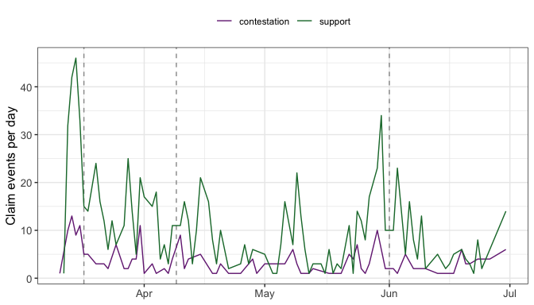

Most network models describe ties **within** one set of actors. Many social
processes, though, run **between** two sets -- authors and papers, legislators
and bills, actors and the claims they make in a public debate. This is a
*two-mode* (or *bipartite*) network, and its dynamics need effects that respect
the two sides.

This vignette reproduces the multimodal Dynamic Network Actor Model (DyNAM) of
@haunss2023, who study how German political actors came to support claims in the
discourse that followed the March 2011 Fukushima disaster -- the four months in
which the government reversed course from extending nuclear plants' lifetimes to
committing to a full phase-out. Along the way it shows:

- how to convert a `manynet` two-mode object into the `stocnet` goldfish
  consumes;
- which effects a two-mode focal layer admits, and why the one-mode closure
  effects (`recip`, `trans`, `cycle`) do not apply;
- the actor-oriented **rate** and **choice** sub-models over a two-mode network,
  including the *tertius* effects that generalize homophily to two modes;
- how structural missingness (a non-politician has no party) differs from
  informative missingness, and why it is handled at conversion rather than by
  imputation.


``` r
library(goldfish)
library(manynet)
library(ggplot2)
```

# The data

`manynet::irps_nuclear` is the discourse network as a dynamic, labelled,
two-mode `manynet` object: 337 political **actors** and 54 **concepts** (claims),
with 1164 timed *claim* events between 2011-03-11 and 2011-06-30. Each event is a
statement by an actor either supporting (`increment = +1`) or contesting
(`increment = -1`) a claim.


``` r
data("irps_nuclear", package = "manynet")
irps_nuclear
#> 
#> ── # German nuclear discourse network ──────────────────────────────────────────
#> # A dynamic, labelled, two-mode network of 337 speakers and 54 concepts and
#> 1164 claim ties from 2011-03-11 to 2011-06-30
#> 
#> ── Nodes
#> # A tibble: 391 × 10
#>   name         type  present politician govt  coalition office org   party power
#>   <chr>        <lgl> <lgl>   <lgl>      <lgl> <lgl>     <lgl>  <chr> <chr> <int>
#> 1 VfEW         FALSE TRUE    FALSE      FALSE NA        FALSE  VfEW  <NA>      0
#> 2 Angela Merk… FALSE TRUE    TRUE       TRUE  TRUE      TRUE   CDU   31        2
#> 3 Sunday Times FALSE TRUE    FALSE      FALSE NA        FALSE  Sund… <NA>      0
#> 4 SPD          FALSE TRUE    TRUE       FALSE FALSE     FALSE  SPD   32        1
#> 5 Norbert Röt… FALSE TRUE    TRUE       TRUE  TRUE      TRUE   CDU   31        1
#> 6 Torsten Kra… FALSE TRUE    FALSE      FALSE NA        FALSE  Die … <NA>      0
#> # ℹ 385 more rows
#> 
#> ── Ties
#> # A tibble: 1,164 × 5
#>    from    to time       increment default
#>   <int> <int> <date>         <int> <lgl>  
#> 1     1   338 2011-03-11        -1 FALSE  
#> 2     2   339 2011-03-12         1 TRUE   
#> 3     3   340 2011-03-13        -1 FALSE  
#> 4     4   341 2011-03-13         1 TRUE   
#> 5     2   342 2011-03-13        -1 TRUE   
#> 6     5   343 2011-03-13         1 TRUE   
#> # ℹ 1,158 more rows
#> 
```

The node table marks the mode with `type` (`FALSE` for an actor, `TRUE` for a
concept) and carries the actor attributes the paper models -- whether the actor
is a `politician`, holds `office`, belongs to the `govt`, its formal `power`
(0/1/2), and its `party`. The tie table carries `increment` and a `default` flag
marking the events the paper models.

# Converting to a `stocnet`

goldfish consumes a single `stocnet` object (see `?goldfish_data`). The
conversion from the two-mode `manynet` object follows five rules, each of which
is a modeling decision worth making explicit.


``` r
irps_to_stocnet <- function(mnet) {
  nodes_raw <- as.data.frame(tidygraph::as_tibble(
    tidygraph::activate(mnet, "nodes")
  ))
  ties_raw <- as.data.frame(tidygraph::as_tibble(
    tidygraph::activate(mnet, "edges")
  ))

  # (1) The mode. `type` marks the two sides; it becomes the reserved `mode`
  #     column. `individual` (natural person, not office-holder) is derived.
  is_actor <- !nodes_raw$type
  individual <- (nodes_raw$org != nodes_raw$name | is.na(nodes_raw$org)) &
    !nodes_raw$office

  # (2) Structural missingness -> a sentinel, at conversion. A non-politician
  #     cannot hold a party or formal power: the value is absent by definition,
  #     not missing-and-worth-modeling. Recoding NA -> 0 here means no NA ever
  #     reaches goldfish's imputation seam; the diversity summarizer below then
  #     excludes the 0. (See the closing section.)
  nodes <- data.frame(
    label = nodes_raw$name,
    mode = ifelse(is_actor, "actor", "concept"),
    # Actors are always present; claims are activated below.
    active = is_actor,
    politician = nodes_raw$politician,
    govt = nodes_raw$govt,
    office = nodes_raw$office,
    individual = individual,
    party = ifelse(is.na(nodes_raw$party), 0L, as.integer(nodes_raw$party)),
    power = ifelse(is.na(nodes_raw$power), 0L, nodes_raw$power),
    stringsAsFactors = FALSE
  )

  # (3) Support and contestation are separate processes -> separate layers.
  #     Support (+1) is the focal, modeled layer; contestation (-1, flipped to
  #     +1 so `indeg()` counts it) is a covariate layer, never modeled.
  time_num <- as.numeric(ties_raw$time)
  support_rows <- ties_raw$increment == 1
  contest_rows <- ties_raw$increment == -1
  support <- data.frame(
    from = ties_raw$from[support_rows],
    to = ties_raw$to[support_rows],
    time = time_num[support_rows],
    increment = 1,
    layer = "support",
    # (4) The paper models the `default` support events; the rest still update
    #     the network state. A `flavor` column marks the modeled sub-process.
    flavor = ifelse(ties_raw$default[support_rows], "default", NA_character_),
    stringsAsFactors = FALSE
  )
  contestation <- data.frame(
    from = ties_raw$from[contest_rows],
    to = ties_raw$to[contest_rows],
    time = time_num[contest_rows],
    increment = 1,
    layer = "contestation",
    flavor = NA_character_,
    stringsAsFactors = FALSE
  )
  ties <- rbind(support, contestation)
  ties <- ties[order(ties$time), ]

  # (5) Claims are choosable from their own introduction: each concept activates
  #     one second (on the numeric-day axis) before its first event, and never
  #     deactivates. A concept never used in this window stays inactive.
  concept_ids <- which(!is_actor)
  first_event <- tapply(
    time_num, factor(ties_raw$to, levels = concept_ids), min
  )
  activated <- concept_ids[!is.na(first_event)]
  changes <- data.frame(
    time = first_event[!is.na(first_event)] - 1 / 86400,
    node = activated,
    var = "active",
    stringsAsFactors = FALSE
  )
  changes$value <- as.list(rep(TRUE, nrow(changes)))
  changes <- changes[order(changes$time), ]

  info <- list(
    name = "IRPS nuclear discourse",
    focal = "support",
    directed = c(support = TRUE, contestation = TRUE),
    update = c(support = "increment", contestation = "increment"),
    observation = c(support = "event", contestation = "event"),
    # Both layers run actor -> concept: a two-mode declaration per layer.
    sender = c(support = "actor", contestation = "actor"),
    receiver = c(support = "concept", contestation = "concept"),
    active = list(update = "replace")
  )

  manynet::make_stocnet(
    info = info, nodes = nodes, ties = ties, changes = changes
  )
}

nuclear <- as_goldfish(irps_to_stocnet(irps_nuclear))
nuclear
#> ── IRPS nuclear discourse ──────────────────────────────────────────────────────
#> 2 layers, 391 nodes, 1164 ties.
#> 
#> ── Layers
#> • contestation: event, directed, increment
#> • support (focal): event, directed, increment
#> 54 attribute changes.
```

The focal `support` layer is `actor -> concept`, so goldfish reads it as
two-mode and reports the mode pair on the object.

# Effects on a two-mode focal layer

The sender and receiver of a support event are *different* kinds of node, so the
one-mode closure effects have no meaning: there is no reciprocated actor→actor
tie to a claim, no actor→actor→actor triangle. goldfish rejects them by name,
comparing the modes rather than the matrix dimensions:


``` r
# `recip()` needs a reciprocated tie, but an actor->claim tie has no
# claim->actor counterpart. goldfish aborts, naming the two modes:
tryCatch(
  estimate_dynam(
    make_specification(
      choice = list(default ~ indeg(support) + recip(support)),
      model = "DyNAM", choice_sub_model = "choice", data = nuclear
    ),
    preprocessing_only = TRUE
  ),
  error = function(e) cat(conditionMessage(e))
)
#> `recip()` cannot be computed on "support".
#> ✖ the sender side of layer "support" (mode "actor") and the receiver side of
#>   layer "support" (mode "concept") must be the same node set.
#> ℹ On a two-mode focal layer use one of: `inertia()`, `tie()`, `indeg(type =
#>   "alter")`, `outdeg(type = "ego")`, `four()`, `ego()`, `alter()`, `same()`,
#>   `diff()`, `sim()`, `ego_alter_interaction()`, `tertius(type = "alter")`,
#>   `tertius_diff()`, and `global()`.
```

What a two-mode focal layer *does* admit are the effects that read a single side
or bridge the two through a shared neighbor: degree effects (`outdeg` on the
sender side, `indeg` on the receiver side), the two-mode closure `four` (a
four-cycle: two actors supporting two claims), the attribute effects (`ego`,
`alter`, `same`), and the *tertius* effects that summarize the attributes of a
claim's existing supporters. These are exactly the building blocks of the
paper's models.

# The rate sub-model: who supports claims more often?

The rate sub-model asks which actors make support events more frequently. The
paper proposes four mechanisms [@haunss2023]: activity (M1, an actor who has made
many claims makes more), power (M2), office (M3), and being an individual rather
than an organization (M4).


``` r
rate_fit <- estimate_dynam(
  make_specification(
    rate = list(
      default ~ 1 + outdeg(support) + ego(power) + ego(office) + ego(individual)
    ),
    model = "DyNAM", rate_sub_model = "rate", data = nuclear
  ),
  sub_model = "rate"
)
summary(rate_fit)
#> 
#> Call:
#> estimate_dynam(support ~ 1 + outdeg(support) + ego(power) + ego(office) + 
#>     ego(individual))
#> 
#> 
#> Coefficients:
#>                 Estimate Std. Error  z-value  Pr(>|z|)    
#> Intercept      -5.248208   0.105693 -49.6553 < 2.2e-16 ***
#> outdeg/support  0.069499   0.010264   6.7715 1.275e-11 ***
#> ego/power       1.879159   0.082443  22.7934 < 2.2e-16 ***
#> ego/office     -0.119250   0.148623  -0.8024    0.4223    
#> ego/individual -0.095416   0.107899  -0.8843    0.3765    
#> ---
#> Signif. codes:  0 '***' 0.001 '**' 0.01 '*' 0.05 '.' 0.1 ' ' 1
#> 
#>   Return code 1: gradient close to zero
#>     score (rel. norm): 4.03e-09    step (max|update|): 2.96e-08
#>   5 parameters estimated  
#>   Log-Likelihood: -2284
#>   AIC:  4578.1 
#>   AICc: 4578.2 
#>   BIC:  4599.7 
#>   model: "DyNAM" sub_model: "rate"
```

`outdeg(support)` reads the sender side (an actor's own support activity);
`ego(power)`, `ego(office)`, and `ego(individual)` read sender attributes.
Powerful actors participate markedly more often -- the paper's most robust rate
finding.

# The choice sub-model: which claims do they support?

Given that an actor acts, which claim do they support? The choice sub-model is a
conditional logit over the claims available at that moment. The paper's six
mechanisms are support popularity (M5), contestation popularity (M6), shared
choices (M7, the `four` cycle), and three *tertius* effects summarizing the
supporters a claim has already attracted: their maximum power (M8), their
government homophily with the ego (M9), and the party diversity among them (M10).

A tertius effect aggregates a covariate over a claim's current supporters with a
`summarizer_fn`. Two of the paper's summarizers exclude the structural-absence
sentinel (`0`) so that non-politician supporters, who have no formal power and no
party, do not distort the aggregate:


``` r
max_power <- function(x) {
  x <- x[x != 0]
  if (!length(x)) 0 else max(x)
}
# Shannon diversity of parties among a claim's partied supporters.
party_diversity <- function(x) {
  x <- x[x != 0]
  if (!length(x)) return(0)
  p <- proportions(table(x))
  -sum(p * log(p))
}

choice_fit <- estimate_dynam(
  make_specification(
    choice = list(
      default ~ indeg(support) + indeg(contestation) + four(support) +
        tertius(support, power, summarizer_fn = max_power) +
        tertius_diff(support, govt,
          summarizer_fn = function(x) mean(x, na.rm = TRUE)
        ) +
        tertius(support, party, summarizer_fn = party_diversity)
    ),
    model = "DyNAM", choice_sub_model = "choice", data = nuclear
  )
)
summary(choice_fit)
#> 
#> Call:
#> estimate_dynam(support ~ indeg(support) + indeg(contestation) + 
#>     four(support) + tertius(support, power, summarizer_fn = max_power) + 
#>     tertius_diff(support, govt, summarizer_fn = function(x) mean(x, 
#>         na.rm = TRUE)) + tertius(support, party, summarizer_fn = party_diversity))
#> 
#> 
#> Coefficients:
#>                                  Estimate Std. Error z-value  Pr(>|z|)    
#> indeg/support                   0.0245406  0.0072905  3.3661 0.0007623 ***
#> indeg/contestation              0.0110924  0.0092999  1.1927 0.2329705    
#> four/support                    0.0083910  0.0044060  1.9045 0.0568494 .  
#> tertius/support·power [fn]      0.1484264  0.0807497  1.8381 0.0660470 .  
#> tertius_diff/support·govt [fn] -0.4071584  0.1965859 -2.0711 0.0383450 *  
#> tertius/support·party [fn]      1.1812094  0.1327011  8.9013 < 2.2e-16 ***
#> ---
#> Signif. codes:  0 '***' 0.001 '**' 0.01 '*' 0.05 '.' 0.1 ' ' 1
#> 
#> fn = user-defined function
#> (use compact = FALSE for full effect/object names & details)
#> 
#>   Return code 1: gradient close to zero
#>     score (rel. norm): 2.77e-09    step (max|update|): 1.72e-09
#>   6 parameters estimated  
#>   Log-Likelihood: -1765.5
#>   AIC:  3542.9 
#>   AICc: 3543.1 
#>   BIC:  3568.7 
#>   model: "DyNAM" sub_model: "choice"
```

The positive `tertius` party-diversity coefficient is the paper's headline
choice finding: actors gravitate to claims already supported by a *diverse* set
of parties -- a cross-party coalition -- rather than to claims backed by their
own camp alone.

# The four discursive periods

@haunss2023 split the four months into four sub-periods at the discourse's
turning points and fit the models separately in each, because the mechanisms
shift as the debate evolves. goldfish fits a period by restricting the estimation
window with `control_preprocessing`; statistics still cumulate over the full
history up to each event.


``` r
boundaries <- as.numeric(as.Date(
  c("2011-03-11", "2011-03-17", "2011-04-09", "2011-06-01", "2011-07-01")
))
period_labels <- c("P1: 11-16 Mar", "P2: 17 Mar-8 Apr",
  "P3: 9 Apr-31 May", "P4: 1 Jun-1 Jul")

period_fits <- lapply(seq_len(4), function(p) {
  estimate_dynam(
    make_specification(
      choice = list(
        default ~ indeg(support) + indeg(contestation) + four(support)
      ),
      model = "DyNAM", choice_sub_model = "choice", data = nuclear
    ),
    control_preprocessing = set_preprocessing_opt(
      start_time = boundaries[p], end_time = boundaries[p + 1]
    )
  )
})

period_coefs <- do.call(rbind, lapply(seq_len(4), function(p) {
  cf <- period_fits[[p]]
  data.frame(
    period = period_labels[p],
    effect = names(coef(cf)),
    estimate = coef(cf),
    se = sqrt(diag(vcov(cf)))
  )
}))
```


``` r
ggplot(period_coefs, aes(estimate, effect)) +
  geom_vline(xintercept = 0, linetype = "dashed", color = "grey60") +
  geom_pointrange(aes(
    xmin = estimate - 1.96 * se, xmax = estimate + 1.96 * se
  )) +
  facet_wrap(~period, nrow = 1) +
  labs(x = "Coefficient (95% CI)", y = NULL) +
  theme_bw() +
  theme(
    axis.text = element_text(size = 10),
    axis.title = element_text(size = 12),
    strip.text = element_text(size = 10)
  )
```

<div class="figure">

<p class="caption">plot of chunk period-plot</p>
</div>

Support popularity is strongest early, when the debate is forming, and fades as
positions harden -- the kind of phase-dependent shift the periodization is meant
to expose.

# The shape of the discourse

The pace of the debate itself is informative. Plotting support and contestation
events per day recovers Figure 1 of the paper: a burst of activity after
Fukushima, then punctuated waves at the period boundaries.


``` r
ties <- nuclear$ties
events_per_day <- aggregate(
  list(n = ties$time),
  by = list(day = as.Date(ties$time, origin = "1970-01-01"), layer = ties$layer),
  FUN = length
)

ggplot(events_per_day, aes(day, n, color = layer)) +
  geom_vline(
    xintercept = as.Date(c("2011-03-17", "2011-04-09", "2011-06-01")),
    linetype = "dashed", color = "grey60"
  ) +
  geom_line() +
  scale_color_manual(values = c(support = "#1b7837", contestation = "#762a83")) +
  labs(x = NULL, y = "Claim events per day", color = NULL) +
  theme_bw() +
  theme(
    legend.position = "top",
    axis.text = element_text(size = 10),
    axis.title = element_text(size = 12)
  )
```

<div class="figure">

<p class="caption">plot of chunk events-per-day</p>
</div>

# Structural versus informative missingness

The nuclear data illustrates a distinction worth keeping. A non-politician actor
has no `party` and no formal `power` -- not because the value was lost, but
because the actor is *not in that space at all*: a company or an NGO simply does
not hold a party affiliation. This is **structural** absence, and it is handled
at conversion by the sentinel recode (`NA -> 0`), with the tertius summarizers
excluding the sentinel. The party diversity of a claim is then the diversity
among its *partied* supporters, and a company contributes nothing to it -- which
is correct.

Contrast this with **informative** missingness, where being missing is itself a
state worth modeling (a survey non-response, say). There goldfish's imputation
contract applies, or a reserved "(missing)" category. Reaching for that here
would be wrong: it would manufacture a phantom "no-party" bloc and inflate every
claim's measured diversity. Because the recode happens *before* the object is
built, no missing value ever reaches goldfish's imputation seam; the modeling
decision is made where it belongs, in the conversion.

# References
