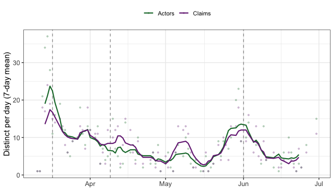
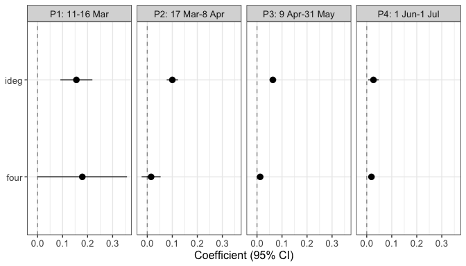

Most network models describe ties **within** one set of actors. Many social
processes, though, run **between** two sets -- authors and papers, legislators
and bills, actors and the claims they make in a public debate. This is a
*two-mode* (or *bipartite*) network, and its dynamics need effects that respect
the two sides.

This vignette reproduces the multimodal Dynamic Network Actor Model (DyNAM) of
@haunss2023, who study how German political actors came to support claims in the
discourse that followed the March 2011 Fukushima disaster -- the four months in
which the government reversed course from extending nuclear plants' lifetimes to
committing to a full phase-out. Along the way it shows:

- how to build a goldfish `stocnet` from a `manynet` two-mode object using the
  `manynet` verb pipeline, on goldfish's native POSIXct time axis;
- which effects a two-mode focal layer admits, and why the one-mode closure
  effects (`recip`, `trans`, `cycle`) do not apply;
- the actor-oriented **rate** and **choice** sub-models over a two-mode network,
  including the *tertius* effects that generalize homophily to two modes;
- how to model discursive periods two equivalent ways -- interacted global
  dummies, and separate window fits -- and why they agree exactly;
- how structural missingness (a non-politician has no party) differs from
  informative missingness, and why it is handled at conversion rather than by
  imputation.


``` r
library(goldfish)
library(manynet)
library(dplyr)
library(lubridate)
library(ggplot2)
```

# The data

`manynet::irps_nuclear` is the discourse network as a dynamic, labelled,
two-mode `manynet` object: 337 political **actors** and 54 **concepts** (claims),
with 1164 timed *claim* events between 2011-03-11 and 2011-06-30. Each event is a
statement by an actor either supporting (`weight = +1`) or contesting
(`weight = -1`) a claim.


``` r
data("irps_nuclear", package = "manynet")
irps_nuclear
#> 
#> ── # German nuclear discourse network ──────────────────────────────────────────
#> # A dynamic, labelled, two-mode network of 337 speakers and 54 concepts and
#> 1164 claim ties from 2011-03-11 to 2011-06-30
#> 
#> ── Nodes
#> # A tibble: 391 × 10
#>   name         type  present politician govt  coalition office org   party power
#>   <chr>        <lgl> <lgl>   <lgl>      <lgl> <lgl>     <lgl>  <chr> <chr> <int>
#> 1 VfEW         FALSE TRUE    FALSE      FALSE NA        FALSE  VfEW  <NA>      0
#> 2 Angela Merk… FALSE TRUE    TRUE       TRUE  TRUE      TRUE   CDU   31        2
#> 3 Sunday Times FALSE TRUE    FALSE      FALSE NA        FALSE  Sund… <NA>      0
#> 4 SPD          FALSE TRUE    TRUE       FALSE FALSE     FALSE  SPD   32        1
#> 5 Norbert Röt… FALSE TRUE    TRUE       TRUE  TRUE      TRUE   CDU   31        1
#> 6 Torsten Kra… FALSE TRUE    FALSE      FALSE NA        FALSE  Die … <NA>      0
#> # ℹ 385 more rows
#> 
#> ── Ties
#> # A tibble: 1,164 × 5
#>    from    to time       increment default
#>   <int> <int> <date>         <int> <lgl>  
#> 1     1   338 2011-03-11        -1 FALSE  
#> 2     2   339 2011-03-12         1 TRUE   
#> 3     3   340 2011-03-13        -1 FALSE  
#> 4     4   341 2011-03-13         1 TRUE   
#> 5     2   342 2011-03-13        -1 TRUE   
#> 6     5   343 2011-03-13         1 TRUE   
#> # ℹ 1,158 more rows
#> 
```

The node table marks the mode with `type` (`FALSE` for an actor, `TRUE` for a
concept) and carries the actor attributes the paper models -- whether the actor
holds `office`, belongs to the `govt`, its formal `power` (0/1/2), and its
`party`. The tie table carries the `weight` (the increment's sign) and a
`default` flag marking the events the paper models.

# Building the `stocnet`

goldfish consumes a single `stocnet` object (see `?goldfish_data`). The
`manynet` verbs build it in one pipeline: `as_stocnet()` reads the two-mode
`manynet` object, `mutate_ties()` / `mutate_nodes()` reshape the streams,
`add_info()` records the modeling roles, and `bind_changes()` /
`mutate_globals()` attach the time-varying state. Each step below is a modeling
decision worth making explicit.

## Ties: two layers on a datetime axis

`as_stocnet(twomode = TRUE)` returns the discourse as one `claim` layer with a
signed `weight`. Support (+1) and contestation (−1) are *different* processes, so
they split into two layers by the sign; the support layer is the focal, modeled
one, and contestation is a covariate. goldfish applies the tie `weight` as the
update value, so both layers carry `weight = 1` (the contestation −1 is flipped
to +1 so `indeg()` counts it). The paper models only the `default` support
events; the `flavor` column marks those as `"modeled"` and the rest as
`"conditional"`, so the non-default rows still update the network state without
becoming choices. Finally, `time` casts to **POSIXct** -- goldfish's native axis
(both shipped datasets are POSIXct), and the axis a sub-day activation offset
needs (below).

## Nodes: modes, a derived attribute, and structural missingness

`mode` maps the two sides to the names the layers reference (`actor` /
`concept`); an actor is a natural person unless it is an organization or an
office-holder (`individual`). A non-politician *cannot* hold a `party` or formal
`power`: the value is absent by definition, not missing-and-worth-modeling.
Recoding those `NA`s to a `0` sentinel here, at conversion, means no `NA` ever
reaches goldfish's imputation seam; the diversity summarizers later exclude the
`0`. (See the closing section on structural versus informative missingness.)


``` r
nuclear <- as_stocnet(irps_nuclear, twomode = TRUE) |>
  mutate_ties(
    layer  = if_else(weight == 1, "support", "contestation"),
    flavor = if_else(weight == 1 & default %in% TRUE, "modeled",
      if_else(weight == 1, "conditional", NA_character_)),
    weight = 1,
    time   = as.POSIXct(time, tz = "UTC")
  ) |>
  mutate_nodes(
    party      = if_else(is.na(party), 0L, as.integer(party)),
    power      = if_else(is.na(power), 0L, power),
    individual = (org != label | is.na(org)) & !office,
    mode       = if_else(active, "actor", "concept")
  )
```

## Activation: a claim is choosable only from its own introduction

A concept enters the choice set the moment it is first raised, and not before.
Each concept therefore activates just before its first event -- and it must be
*strictly* before, because at an equal timestamp goldfish processes the dependent
(choice) event ahead of a composition change, so a claim activated *at* its
introducing event would not yet be choosable when that event is evaluated. One
**hour** before is readable, sub-day, and correct (a daily-axis `- days(1)` would
make each claim spuriously choosable for the whole prior day).


``` r
first_event <- tapply(nuclear$ties$time, nuclear$ties$to, min)
concept_idx <- as.integer(names(first_event))
activation <- tibble(
  time  = as.POSIXct(first_event, tz = "UTC", origin = "1970-01-01") - hours(1),
  node  = nuclear$nodes$label[concept_idx],
  value = TRUE
)
```

## Discursive periods as global step dummies

@haunss2023 split the four months into four sub-periods at the discourse's
turning points. We encode the split as three global step dummies -- `period2`
turns on at 17 Mar, `period3` at 9 Apr, `period4` at 1 Jun -- so a model can
interact any effect with them. Two details make them behave:

- Each dummy needs a `time = NA` **initial value** (the "before the window"
  row). Without it the first dependent event reads a missing global and
  preprocessing aborts.
- For the same reason activation is offset, the step is set one hour *before* the
  boundary date, so every event on the boundary day already sees the new period.


``` r
boundaries <- as.POSIXct(c("2011-03-17", "2011-04-09", "2011-06-01"), tz = "UTC")
step_time  <- boundaries - hours(1)
na_utc     <- as.POSIXct(NA, tz = "UTC")
```

Two datetime gotchas the recipe guards against. First, `as.POSIXct(<Date>)`
without `tz` shifts midnight by the local offset and can reorder events across a
day boundary, so the casts pin `tz = "UTC"`. Second, `c(NA, <POSIXct>)` coerces
the vector to numeric (the logical `NA` wins), which trips goldfish's mixed-axis
guard; a typed `na_utc <- as.POSIXct(NA, tz = "UTC")` keeps the initial value on
the datetime axis.


``` r
nuclear <- nuclear |>
  add_info(
    name  = "IRPS nuclear discourse",
    ties  = c("support", "contestation"),
    # focal sets the default dependent layer. The specifications below key a
    # flavor ("modeled ~ ...") to it, so focal is what names the support layer
    # here; a plain `layer ~ ...` LHS (or a spec `layer =`) makes it optional.
    focal = "support",
    directed    = c(support = TRUE, contestation = TRUE),
    update      = c(support = "increment", contestation = "increment"),
    observation = c(support = "event", contestation = "event"),
    # Both layers run actor -> concept: a two-mode declaration per layer.
    sender   = c(support = "actor", contestation = "actor"),
    receiver = c(support = "concept", contestation = "concept"),
    active   = list(update = "replace")
  ) |>
  bind_changes(activation, var = "active") |>
  mutate_globals(
    time  = c(na_utc, step_time[1], na_utc, step_time[2], na_utc, step_time[3]),
    var   = rep(c("period2", "period3", "period4"), each = 2),
    value = as.list(c(0, 1, 0, 1, 0, 1))
  )

nuclear <- as_goldfish(nuclear)
nuclear
#> ── IRPS nuclear discourse ──────────────────────────────────────────────────────
#> 2 layers, 391 nodes, 1164 ties.
#> 
#> ── Layers
#> • contestation: event, directed, increment
#> • support (focal): event, directed, increment
#> 54 attribute changes, 6 global events.
```

The `support` layer -- the default focal, `actor -> concept` -- is read as
two-mode, and goldfish reports the mode pair on the printed object above, which
annotates it `support (focal)`. `focal` is a default here rather than a
requirement: it names the layer the flavor-keyed specifications resolve against,
and a model whose formula LHS (or specification `layer`) names the layer
directly needs no `focal` at all.

# The shape of the discourse

Before modeling, the pace of the debate is itself informative. Figure 1 of the
paper counts the distinct **actors** speaking and distinct **claims** raised each
day. Reading them straight off the assembled object -- `n_distinct(from)` senders
and `n_distinct(to)` receivers per day, smoothed with a 7-day rolling mean --
recovers the burst of activity after Fukushima and the punctuated waves at the
period boundaries.


``` r
per_day <- nuclear$ties |>
  mutate(day = as.Date(time)) |>
  group_by(day) |>
  summarise(
    Actors = n_distinct(from),
    Claims = n_distinct(to),
    .groups = "drop"
  ) |>
  tidyr::pivot_longer(c(Actors, Claims), names_to = "series", values_to = "n") |>
  group_by(series) |>
  mutate(roll = as.numeric(stats::filter(n, rep(1 / 7, 7), sides = 2))) |>
  ungroup()

ggplot(per_day, aes(day, color = series)) +
  geom_vline(
    xintercept = as.Date(c("2011-03-17", "2011-04-09", "2011-06-01")),
    linetype = "dashed", color = "grey60"
  ) +
  geom_point(aes(y = n), alpha = 0.25, size = 0.8) +
  geom_line(aes(y = roll), linewidth = 0.8) +
  scale_color_manual(values = c(Actors = "#1b7837", Claims = "#762a83")) +
  labs(x = NULL, y = "Distinct per day (7-day mean)", color = NULL) +
  theme_bw() +
  theme(
    legend.position = "top",
    axis.text = element_text(size = 10),
    axis.title = element_text(size = 12)
  )
#> Warning: Removed 12 rows containing missing values or values outside the scale range
#> (`geom_line()`).
```

<div class="figure">

<p class="caption">plot of chunk fig1</p>
</div>

# Effects on a two-mode focal layer

The sender and receiver of a support event are *different* kinds of node, so the
one-mode closure effects have no meaning: there is no reciprocated actor→actor
tie to a claim, no actor→actor→actor triangle. goldfish rejects them by name,
comparing the modes rather than the matrix dimensions:


``` r
# `recip()` needs a reciprocated tie, but an actor->claim tie has no
# claim->actor counterpart. goldfish aborts, naming the two modes:
tryCatch(
  estimate_dynam(
    make_specification(
      choice = list(modeled ~ indeg(support) + recip(support)),
      model = "DyNAM", choice_sub_model = "choice", data = nuclear
    ),
    preprocessing_only = TRUE
  ),
  error = function(e) cat(conditionMessage(e))
)
#> `recip()` cannot be computed on "support".
#> ✖ the sender side of layer "support" (mode "actor") and the receiver side of
#>   layer "support" (mode "concept") must be the same node set.
#> ℹ On a two-mode focal layer use one of: `inertia()`, `tie()`, `indeg(type =
#>   "alter")`, `outdeg(type = "ego")`, `four()`, `ego()`, `alter()`, `same()`,
#>   `diff()`, `sim()`, `ego_alter_interaction()`, `tertius(type = "alter")`,
#>   `tertius_diff()`, and `global()`.
```

What a two-mode focal layer *does* admit are the effects that read a single side
or bridge the two through a shared neighbor: degree effects (`outdeg` on the
sender side, `indeg` on the receiver side), the two-mode closure `four` (a
four-cycle: two actors supporting two claims), the attribute effects (`ego`,
`alter`, `same`), and the *tertius* effects that summarize the attributes of a
claim's existing supporters. These are exactly the building blocks of the
paper's models.

# The rate sub-model: who supports claims more often?

The rate sub-model asks which actors make support events more frequently. The
paper proposes four mechanisms [@haunss2023]: activity (M1, an actor who has made
many claims makes more), power (M2), office (M3), and being an individual rather
than an organization (M4). The formula's left side is `modeled` -- the `flavor`
value that marks the dependent support events.


``` r
rate_fit <- estimate_dynam(
  make_specification(
    rate = list(
      modeled ~ 1 + outdeg(support) + ego(power) + ego(office) + ego(individual)
    ),
    model = "DyNAM", rate_sub_model = "rate", data = nuclear
  ),
  sub_model = "rate"
)
summary(rate_fit)
#> 
#> Call:
#> estimate_dynam(support ~ 1 + outdeg(support) + ego(power) + ego(office) + 
#>     ego(individual))
#> 
#> 
#> Coefficients:
#>                  Estimate Std. Error   z-value  Pr(>|z|)    
#> Intercept      -16.614951   0.105693 -157.2003 < 2.2e-16 ***
#> outdeg/support   0.069499   0.010264    6.7715 1.275e-11 ***
#> ego/power        1.879159   0.082443   22.7934 < 2.2e-16 ***
#> ego/office      -0.119250   0.148623   -0.8024    0.4223    
#> ego/individual  -0.095416   0.107899   -0.8843    0.3765    
#> ---
#> Signif. codes:  0 '***' 0.001 '**' 0.01 '*' 0.05 '.' 0.1 ' ' 1
#> 
#>   Return code 1: gradient close to zero
#>     score (rel. norm): 1.09e-09    step (max|update|): 2.96e-08
#>   5 parameters estimated  
#>   Log-Likelihood: -8478.9
#>   AIC:  16968 
#>   AICc: 16968 
#>   BIC:  16989 
#>   model: "DyNAM" sub_model: "rate"
```

`outdeg(support)` reads the sender side (an actor's own support activity);
`ego(power)`, `ego(office)`, and `ego(individual)` read sender attributes.
Powerful actors participate markedly more often -- the paper's most robust rate
finding.

# The choice sub-model: which claims do they support?

Given that an actor acts, which claim do they support? The choice sub-model is a
conditional logit over the claims available at that moment. The paper's six
mechanisms are support popularity (M5), contestation popularity (M6), shared
choices (M7, the `four` cycle), and three *tertius* effects summarizing the
supporters a claim has already attracted: their maximum power (M8), their
government homophily with the ego (M9), and the party diversity among them (M10).

A tertius effect aggregates a covariate over a claim's current supporters with a
`summarizer_fn`. Two of the paper's summarizers exclude the structural-absence
sentinel (`0`) so that non-politician supporters, who have no formal power and no
party, do not distort the aggregate:


``` r
max_power <- function(x) {
  x <- x[x != 0]
  if (!length(x)) 0 else max(x)
}
# Shannon diversity of parties among a claim's partied supporters.
party_diversity <- function(x) {
  x <- x[x != 0]
  if (!length(x)) return(0)
  p <- proportions(table(x))
  -sum(p * log(p))
}

choice_fit <- estimate_dynam(
  make_specification(
    choice = list(
      modeled ~ indeg(support) + indeg(contestation) + four(support) +
        tertius(support, power, summarizer_fn = max_power) +
        tertius_diff(support, govt,
          summarizer_fn = function(x) mean(x, na.rm = TRUE)
        ) +
        tertius(support, party, summarizer_fn = party_diversity)
    ),
    model = "DyNAM", choice_sub_model = "choice", data = nuclear
  )
)
summary(choice_fit)
#> 
#> Call:
#> estimate_dynam(support ~ indeg(support) + indeg(contestation) + 
#>     four(support) + tertius(support, power, summarizer_fn = max_power) + 
#>     tertius_diff(support, govt, summarizer_fn = function(x) mean(x, 
#>         na.rm = TRUE)) + tertius(support, party, summarizer_fn = party_diversity))
#> 
#> 
#> Coefficients:
#>                                  Estimate Std. Error z-value  Pr(>|z|)    
#> indeg/support                   0.0245406  0.0072905  3.3661 0.0007623 ***
#> indeg/contestation              0.0110924  0.0092999  1.1927 0.2329705    
#> four/support                    0.0083910  0.0044060  1.9045 0.0568494 .  
#> tertius/support·power [fn]      0.1484264  0.0807497  1.8381 0.0660470 .  
#> tertius_diff/support·govt [fn] -0.4071584  0.1965859 -2.0711 0.0383450 *  
#> tertius/support·party [fn]      1.1812094  0.1327011  8.9013 < 2.2e-16 ***
#> ---
#> Signif. codes:  0 '***' 0.001 '**' 0.01 '*' 0.05 '.' 0.1 ' ' 1
#> 
#> fn = user-defined function
#> (use compact = FALSE for full effect/object names & details)
#> 
#>   Return code 1: gradient close to zero
#>     score (rel. norm): 2.77e-09    step (max|update|): 1.72e-09
#>   6 parameters estimated  
#>   Log-Likelihood: -1765.5
#>   AIC:  3542.9 
#>   AICc: 3543.1 
#>   BIC:  3568.7 
#>   model: "DyNAM" sub_model: "choice"
```

The positive `tertius` party-diversity coefficient is the paper's headline
choice finding: actors gravitate to claims already supported by a *diverse* set
of parties -- a cross-party coalition -- rather than to claims backed by their
own camp alone.

# The four discursive periods

The mechanisms shift as the debate evolves, so @haunss2023 fit the models
separately in each sub-period. goldfish expresses this two equivalent ways.

The **interacted** form keeps one model over the full history and interacts each
effect with the period dummies. Because the dummies are cumulative step
functions, a period's slope is the base coefficient plus the interactions that
have switched on by then; interacting *every* term makes the periods fully
separable. In the conditional logit the bare `global()` mains drop out (they are
constant across a choice set), so only the interactions enter.


``` r
choice_periods <- estimate_dynam(
  make_specification(
    choice = list(
      modeled ~ indeg(support) + four(support) +
        indeg(support):global(period2) + indeg(support):global(period3) +
        indeg(support):global(period4) +
        four(support):global(period2) + four(support):global(period3) +
        four(support):global(period4)
    ),
    model = "DyNAM", choice_sub_model = "choice", data = nuclear
  )
)
```

The **windowed** form fits each period on its own estimation window with
`control_preprocessing`; statistics still cumulate over the full history up to
each event. The window cuts and the dummy steps are placed at the *same* sub-day
instant (one hour before each boundary), so both forms partition the daily events
identically.


``` r
period_labels <- c("P1: 11-16 Mar", "P2: 17 Mar-8 Apr",
  "P3: 9 Apr-31 May", "P4: 1 Jun-1 Jul")
window <- as.POSIXct(
  c("2011-03-11 00:00", "2011-03-16 23:00", "2011-04-08 23:00",
    "2011-05-31 23:00", "2011-07-01 00:00"),
  tz = "UTC"
)

period_fits <- lapply(seq_len(4), function(p) {
  estimate_dynam(
    make_specification(
      choice = list(modeled ~ indeg(support) + four(support)),
      model = "DyNAM", choice_sub_model = "choice", data = nuclear
    ),
    control_preprocessing = set_preprocessing_opt(
      start_time = window[p], end_time = window[p + 1]
    )
  )
})
```

The two forms are the same model. A period's windowed `indeg(support)` slope
equals the interacted base plus the cumulative interactions up to that period:


``` r
jc <- coef(choice_periods)
windowed   <- vapply(period_fits, function(f) coef(f)[["ideg"]], numeric(1))
interacted <- jc[["ideg"]] +
  cumsum(c(0, jc[["ideg:glob_period_Fx"]],
    jc[["ideg:glob_period_Fx_1"]], jc[["ideg:glob_period_Fx_2"]]))
data.frame(period = period_labels, windowed, interacted)
#>             period   windowed interacted
#> 1    P1: 11-16 Mar 0.15521452 0.15521452
#> 2 P2: 17 Mar-8 Apr 0.10023403 0.10023403
#> 3 P3: 9 Apr-31 May 0.06339987 0.06339987
#> 4  P4: 1 Jun-1 Jul 0.02693033 0.02693033
```

The windowed fits give a clean per-period coefficient with its own confidence
interval to plot:


``` r
period_coefs <- do.call(rbind, lapply(seq_len(4), function(p) {
  cf <- coef(period_fits[[p]])
  se <- sqrt(diag(vcov(period_fits[[p]])))
  data.frame(
    period = period_labels[p], effect = names(cf),
    estimate = cf, se = se
  )
}))

ggplot(period_coefs, aes(estimate, effect)) +
  geom_vline(xintercept = 0, linetype = "dashed", color = "grey60") +
  geom_pointrange(aes(
    xmin = estimate - 1.96 * se, xmax = estimate + 1.96 * se
  )) +
  facet_wrap(~period, nrow = 1) +
  labs(x = "Coefficient (95% CI)", y = NULL) +
  theme_bw() +
  theme(
    axis.text = element_text(size = 10),
    axis.title = element_text(size = 12),
    strip.text = element_text(size = 10)
  )
```

<div class="figure">

<p class="caption">plot of chunk period-plot</p>
</div>

Support popularity is strongest early, when the debate is forming, and fades as
positions harden -- the kind of phase-dependent shift the periodization is meant
to expose.

# Structural versus informative missingness

The nuclear data illustrates a distinction worth keeping. A non-politician actor
has no `party` and no formal `power` -- not because the value was lost, but
because the actor is *not in that space at all*: a company or an NGO simply does
not hold a party affiliation. This is **structural** absence, and it is handled
at conversion by the sentinel recode (`NA -> 0`), with the tertius summarizers
excluding the sentinel. The party diversity of a claim is then the diversity
among its *partied* supporters, and a company contributes nothing to it -- which
is correct.

Contrast this with **informative** missingness, where being missing is itself a
state worth modeling (a survey non-response, say). There goldfish's imputation
contract applies, or a reserved "(missing)" category. Reaching for that here
would be wrong: it would manufacture a phantom "no-party" bloc and inflate every
claim's measured diversity. Because the recode happens *before* the object is
built, no missing value ever reaches goldfish's imputation seam; the modeling
decision is made where it belongs, in the conversion.

# References
